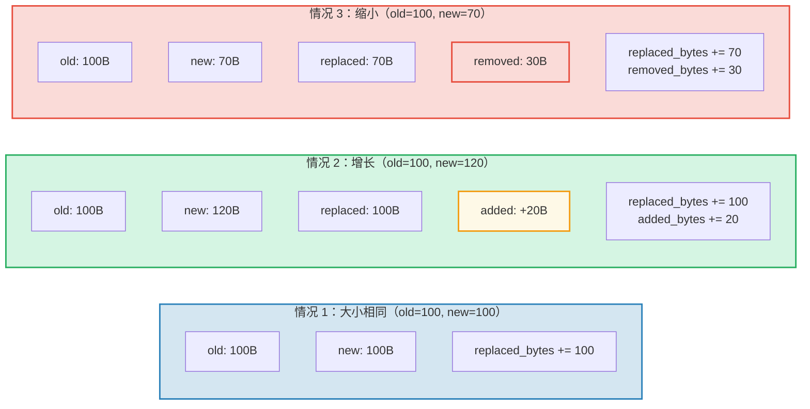

# 开销追踪

## OperationCost 结构

GroveDB 中的每个操作都累积开销，以计算资源来衡量：

```rust
// costs/src/lib.rs
pub struct OperationCost {
    pub seek_count: u32,              // Number of storage seeks
    pub storage_cost: StorageCost,    // Bytes added/replaced/removed
    pub storage_loaded_bytes: u64,    // Bytes read from disk
    pub hash_node_calls: u32,         // Number of Blake3 hash operations
    pub sinsemilla_hash_calls: u32,   // Number of Sinsemilla hash operations (EC ops)
}
```

> **Sinsemilla 哈希调用**追踪 CommitmentTree 锚点的椭圆曲线哈希操作。这些比 Blake3 节点哈希昂贵得多。

存储开销进一步分解：

```rust
// costs/src/storage_cost/mod.rs
pub struct StorageCost {
    pub added_bytes: u32,                   // New data written
    pub replaced_bytes: u32,                // Existing data overwritten
    pub removed_bytes: StorageRemovedBytes, // Data freed
}
```

## CostContext 模式

所有操作将其结果包装在 `CostContext` 中返回：

```rust
pub struct CostContext<T> {
    pub value: T,               // The operation result
    pub cost: OperationCost,    // Resources consumed
}

pub type CostResult<T, E> = CostContext<Result<T, E>>;
```

这创建了一个**单子（monadic）**开销追踪模式 — 开销通过操作链自动流动：

```rust
// Unwrap a result, adding its cost to an accumulator
let result = expensive_operation().unwrap_add_cost(&mut total_cost);

// Chain operations, accumulating costs
let final_result = op1()
    .flat_map(|x| op2(x))      // Costs from op1 + op2
    .flat_map(|y| op3(y));      // + costs from op3
```

## cost_return_on_error! 宏

GroveDB 代码中最常见的模式是 `cost_return_on_error!` 宏，它类似于 `?`，但在提前返回时保留开销：

```rust
macro_rules! cost_return_on_error {
    ( &mut $cost:ident, $($body:tt)+ ) => {
        {
            let result_with_cost = { $($body)+ };
            let result = result_with_cost.unwrap_add_cost(&mut $cost);
            match result {
                Ok(x) => x,
                Err(e) => return Err(e).wrap_with_cost($cost),
            }
        }
    };
}
```

实际使用：

```rust
fn insert_element(&self, path: &[&[u8]], key: &[u8], element: Element) -> CostResult<(), Error> {
    let mut cost = OperationCost::default();

    // Each macro call adds the operation's cost to `cost`
    // and returns the Ok value (or early-returns with accumulated cost on Err)
    let merk = cost_return_on_error!(&mut cost, self.open_merk(path));
    cost_return_on_error!(&mut cost, merk.insert(key, element));
    cost_return_on_error!(&mut cost, self.propagate_changes(path));

    Ok(()).wrap_with_cost(cost)
    // `cost` now contains the sum of all three operations' costs
}
```

## 存储开销分解

当更新一个值时，开销取决于新值是更大、更小还是相同大小：



## 哈希操作开销

哈希开销以"哈希节点调用"衡量 — Blake3 块压缩的次数：

| 操作 | 输入大小 | 哈希调用次数 |
|-----------|-----------|------------|
| `value_hash(small)` | < 64 字节 | 1 |
| `value_hash(medium)` | 64-127 字节 | 2 |
| `kv_hash` | key + value_hash | 取决于大小 |
| `node_hash` | 96 字节（3 × 32） | 2（始终） |
| `combine_hash` | 64 字节（2 × 32） | 1（始终） |
| `node_hash_with_count` | 104 字节（3 × 32 + 8） | 2（始终） |
| Sinsemilla（CommitmentTree） | Pallas 曲线 EC 操作 | 通过 `sinsemilla_hash_calls` 单独追踪 |

Blake3 的通用公式：

```text
hash_calls = 1 + (input_bytes - 1) / 64
```

## 最坏情况和平均情况估算

GroveDB 提供函数在执行操作之前**估算**操作开销。这对于区块链手续费计算至关重要 — 你需要在承诺支付之前知道开销。

```rust
// Worst-case cost for reading a node
pub fn add_worst_case_get_merk_node(
    cost: &mut OperationCost,
    not_prefixed_key_len: u32,
    max_element_size: u32,
    node_type: NodeType,
) {
    cost.seek_count += 1;  // One disk seek
    cost.storage_loaded_bytes +=
        TreeNode::worst_case_encoded_tree_size(
            not_prefixed_key_len, max_element_size, node_type
        ) as u64;
}

// Worst-case propagation cost
pub fn add_worst_case_merk_propagate(
    cost: &mut OperationCost,
    input: &WorstCaseLayerInformation,
) {
    let levels = match input {
        MaxElementsNumber(n) => ((*n + 1) as f32).log2().ceil() as u32,
        NumberOfLevels(n) => *n,
    };
    let mut nodes_updated = levels;

    // AVL rotations may update additional nodes
    if levels > 2 {
        nodes_updated += 2;  // At most 2 extra nodes for rotations
    }

    cost.storage_cost.replaced_bytes += nodes_updated * MERK_BIGGEST_VALUE_SIZE;
    cost.storage_loaded_bytes +=
        nodes_updated as u64 * (MERK_BIGGEST_VALUE_SIZE + MERK_BIGGEST_KEY_SIZE) as u64;
    cost.seek_count += nodes_updated;
    cost.hash_node_calls += nodes_updated * 2;
}
```

使用的常量：

```rust
pub const MERK_BIGGEST_VALUE_SIZE: u32 = u16::MAX as u32;  // 65535
pub const MERK_BIGGEST_KEY_SIZE: u32 = 256;
```

---
