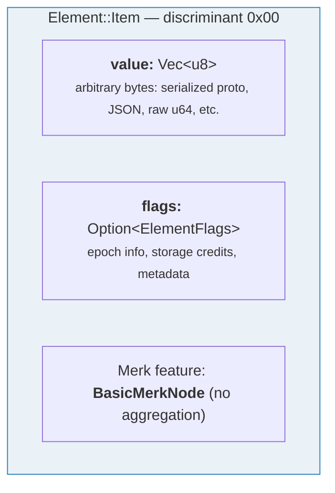
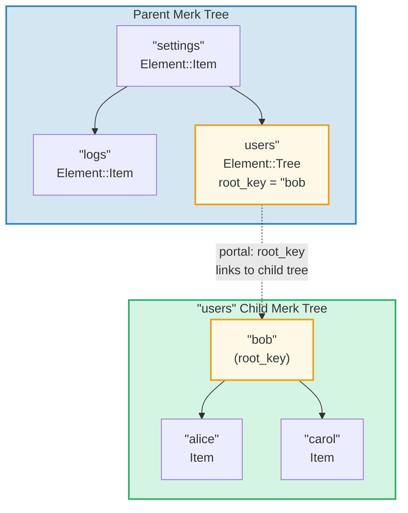
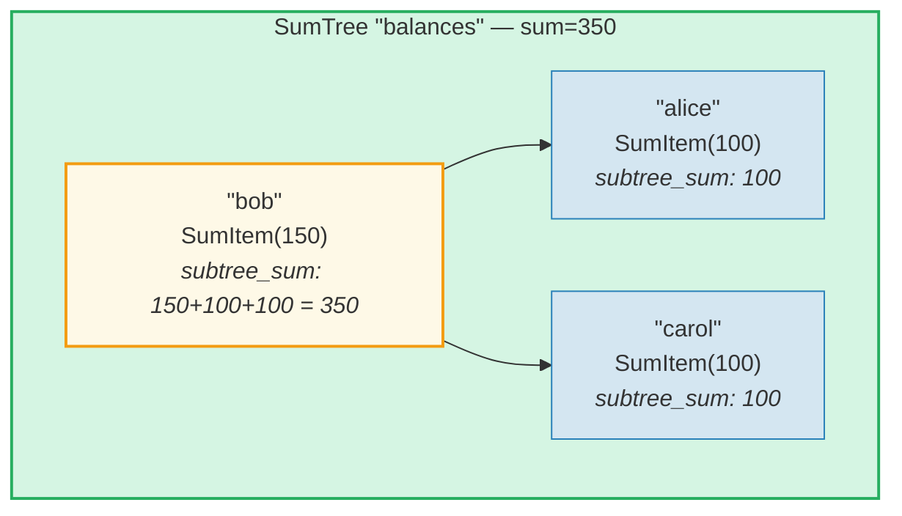
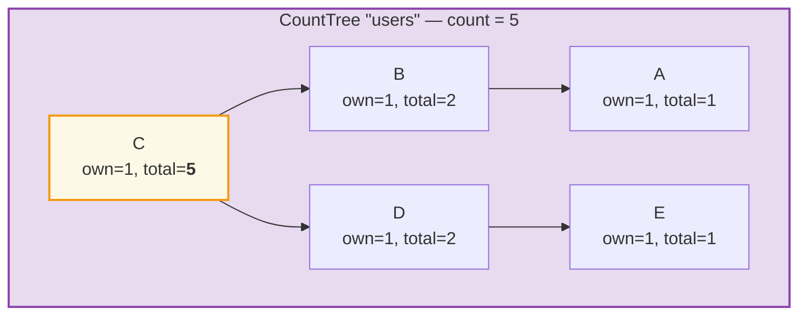
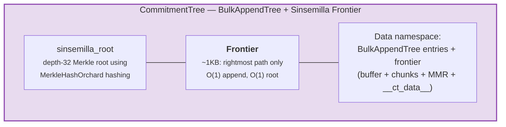

# 元素系统

Merk 处理原始的键值对，而 GroveDB 在更高层次上使用**元素（Element）** — 携带语义含义的类型化值。存储在 GroveDB 中的每个值都是一个元素。

## Element 枚举

```rust
// grovedb-element/src/element/mod.rs
pub enum Element {
    Item(Vec<u8>, Option<ElementFlags>),                                    // [0]
    Reference(ReferencePathType, MaxReferenceHop, Option<ElementFlags>),    // [1]
    Tree(Option<Vec<u8>>, Option<ElementFlags>),                           // [2]
    SumItem(SumValue, Option<ElementFlags>),                               // [3]
    SumTree(Option<Vec<u8>>, SumValue, Option<ElementFlags>),              // [4]
    BigSumTree(Option<Vec<u8>>, BigSumValue, Option<ElementFlags>),        // [5]
    CountTree(Option<Vec<u8>>, CountValue, Option<ElementFlags>),          // [6]
    CountSumTree(Option<Vec<u8>>, CountValue, SumValue, Option<ElementFlags>), // [7]
    ProvableCountTree(Option<Vec<u8>>, CountValue, Option<ElementFlags>),  // [8]
    ItemWithSumItem(Vec<u8>, SumValue, Option<ElementFlags>),              // [9]
    ProvableCountSumTree(Option<Vec<u8>>, CountValue, SumValue,
                         Option<ElementFlags>),                            // [10]
    CommitmentTree(u64, u8, Option<ElementFlags>),                         // [11]
    MmrTree(u64, Option<ElementFlags>),                                    // [12]
    BulkAppendTree(u64, u8, Option<ElementFlags>),                         // [13]
    DenseAppendOnlyFixedSizeTree(u16, u8, Option<ElementFlags>),           // [14]
}
```

方括号中的判别值编号用于序列化。

整个系统中使用的类型别名：

```rust
pub type ElementFlags = Vec<u8>;        // Arbitrary metadata per element
pub type MaxReferenceHop = Option<u8>;  // Optional hop limit for references
pub type SumValue = i64;                // 64-bit signed sum
pub type BigSumValue = i128;            // 128-bit signed sum
pub type CountValue = u64;              // 64-bit unsigned count
```

## Item — 基本键值存储

最简单的元素。存储任意字节：

```rust
Element::Item(value: Vec<u8>, flags: Option<ElementFlags>)
```



构造函数：

```rust
Element::new_item(b"hello world".to_vec())
Element::new_item_with_flags(b"data".to_vec(), Some(vec![0x01, 0x02]))
```

Item 参与求和聚合：在 SumTree 内，Item 贡献默认求和值 0。SumItem 贡献其显式值。

## Tree — 子树的容器

Tree 元素是通往另一棵 Merk 树的**入口**。它存储子树的根键（如果有的话）：

```rust
Element::Tree(root_key: Option<Vec<u8>>, flags: Option<ElementFlags>)
```



> 父 Merk 中的 Tree 元素存储子 Merk 树的 `root_key`。这创建了一个**入口** — 从一棵 Merk 树到另一棵的链接。

当树为空时，`root_key` 为 `None`。构造函数 `Element::empty_tree()` 创建 `Element::Tree(None, None)`。

## SumItem / SumTree — 聚合求和

**SumTree** 自动维护其所有直接子节点求和贡献的总和：

```rust
Element::SumTree(root_key: Option<Vec<u8>>, sum: SumValue, flags: Option<ElementFlags>)
Element::SumItem(value: SumValue, flags: Option<ElementFlags>)
```



> **聚合公式：** `node_sum = own_value + left_child_sum + right_child_sum`
> Bob：150 + 100（alice）+ 100（carol）= **350**。根的求和值（350）存储在父节点的 SumTree 元素中。

求和通过 Merk 层级的 `TreeFeatureType::SummedMerkNode(i64)` 特性类型来维护。在树的传播过程中，每个节点的聚合数据都会重新计算：

```text
aggregate_sum = own_sum + left_child_sum + right_child_sum
```

## CountTree、CountSumTree、BigSumTree

其他聚合树类型：

| 元素类型 | Merk 特性类型 | 聚合内容 |
|---|---|---|
| `CountTree` | `CountedMerkNode(u64)` | 元素数量 |
| `CountSumTree` | `CountedSummedMerkNode(u64, i64)` | 计数和求和 |
| `BigSumTree` | `BigSummedMerkNode(i128)` | 128 位大数值求和 |
| `ProvableCountTree` | `ProvableCountedMerkNode(u64)` | 计数嵌入哈希 |
| `ProvableCountSumTree` | `ProvableCountedSummedMerkNode(u64, i64)` | 计数嵌入哈希 + 求和 |

**ProvableCountTree** 比较特殊：其计数包含在 `node_hash` 计算中（通过 `node_hash_with_count`），因此证明可以在不揭示任何值的情况下验证计数。

## 元素序列化

元素使用 **bincode** 以大端字节序进行序列化：

```rust
pub fn serialize(&self, grove_version: &GroveVersion) -> Result<Vec<u8>, ElementError> {
    let config = config::standard().with_big_endian().with_no_limit();
    bincode::encode_to_vec(self, config)
}
```

第一个字节是**判别值**，允许 O(1) 类型检测：

```rust
pub fn from_serialized_value(value: &[u8]) -> Option<ElementType> {
    match value.first()? {
        0 => Some(ElementType::Item),
        1 => Some(ElementType::Reference),
        2 => Some(ElementType::Tree),
        3 => Some(ElementType::SumItem),
        // ... etc
    }
}
```

## TreeFeatureType 和聚合数据流

`TreeFeatureType` 枚举连接了 GroveDB 元素和 Merk 节点：

```rust
pub enum TreeFeatureType {
    BasicMerkNode,                              // No aggregation
    SummedMerkNode(i64),                       // Sum aggregation
    BigSummedMerkNode(i128),                   // Large sum
    CountedMerkNode(u64),                      // Count
    CountedSummedMerkNode(u64, i64),           // Count + sum
    ProvableCountedMerkNode(u64),              // Count in hash
    ProvableCountedSummedMerkNode(u64, i64),   // Count in hash + sum
}
```

聚合数据**向上**流经树：



> **聚合表：** 每个节点的聚合值 = own(1) + left_aggregate + right_aggregate
>
> | 节点 | own | left_agg | right_agg | total |
> |------|-----|----------|-----------|-------|
> | A | 1 | 0 | 0 | 1 |
> | B | 1 | 1 (A) | 0 | 2 |
> | E | 1 | 0 | 0 | 1 |
> | D | 1 | 0 | 1 (E) | 2 |
> | C | 1 | 2 (B) | 2 (D) | **5**（根） |

每个节点存储的计数表示以该节点为根的子树中的总计数，包括它自己。根节点的计数是整棵树的总数。

`AggregateData` 枚举通过链接系统传递此信息：

```rust
pub enum AggregateData {
    NoAggregateData,
    Sum(i64),
    BigSum(i128),
    Count(u64),
    CountAndSum(u64, i64),
    ProvableCount(u64),
    ProvableCountAndSum(u64, i64),
}
```

## CommitmentTree — Sinsemilla 承诺树

**CommitmentTree** 提供一个深度为 32 的 Sinsemilla 默克尔树，用于跟踪 note commitment anchor（笔记承诺锚点），如 Zcash 的 Orchard 隐蔽协议中所使用。它封装了 `incrementalmerkletree::Frontier<MerkleHashOrchard, 32>` 以实现 O(1) 追加和根计算：

```rust
Element::CommitmentTree(
    total_count: u64,               // Number of commitments appended
    chunk_power: u8,                // BulkAppendTree compaction size (chunk_size = 2^chunk_power)
    flags: Option<ElementFlags>,
)                                   // discriminant [11]
```

> **注意：** Sinsemilla frontier 根哈希不存储在 Element 中。
> 它持久化在数据存储中，并通过 Merk 子哈希机制
>（`insert_subtree` 的 `subtree_root_hash` 参数）流动。对 frontier
> 的任何更改都会自动通过 GroveDB Merk 层次结构向上传播。



**架构：**
- *frontier*（默克尔树的最右路径，约 1KB 常量大小）存储在**数据命名空间**中，键为 `COMMITMENT_TREE_DATA_KEY`
- 实际的 note 数据（`cmx || ciphertext`）通过**数据命名空间**中的 **BulkAppendTree** 存储 — 按块压缩，可按位置检索
- 历史锚点由 Platform 在单独的可证明树中跟踪
- Sinsemilla 根不存储在 Element 中 — 它作为 Merk 子哈希流经 GroveDB 哈希层次结构

**操作：**
- `commitment_tree_insert(path, key, cmx, ciphertext, tx)` — 类型化追加，接受 `TransmittedNoteCiphertext<M>`；返回 `(new_root, position)`
- `commitment_tree_anchor(path, key, tx)` — 获取当前 Orchard Anchor
- `commitment_tree_get_value(path, key, position, tx)` — 按位置检索值
- `commitment_tree_count(path, key, tx)` — 获取总项目数

**MemoSize 泛型：** `CommitmentTree<S, M: MemoSize = DashMemo>` 验证密文负载是否与 `M` 的预期大小匹配。对于 Dash（36 字节备注）：`epk_bytes (32) + enc_ciphertext (104) + out_ciphertext (80) = 216 bytes`。

**开销追踪：** Sinsemilla 哈希操作通过 `cost.sinsemilla_hash_calls` 追踪。根计算始终遍历 32 个级别。Ommer 合并通过前一个位置的 `trailing_ones()` 级联。BulkAppendTree 操作添加 Blake3 哈希开销。

## MmrTree — 默克尔山脉

**MmrTree** 使用 Blake3 哈希将数据存储在仅追加的 Merkle Mountain Range（MMR，默克尔山脉）中。MMR 节点存储在**数据**列（与 Merk 节点相同），而不是在子 Merk 子树中。参见 **[第 13 章](#chapter-13-the-mmr-tree--append-only-authenticated-logs)** 获取关于 MMR 工作原理、填充方式、证明生成和验证以及 MmrTree 如何与 GroveDB 集成的全面深入讲解。

```rust
Element::MmrTree(
    mmr_size: u64,                  // Internal MMR size (nodes, not leaves)
    flags: Option<ElementFlags>,
)                                   // discriminant [12]
```

> **注意：** MMR 根哈希不存储在 Element 中。它作为 Merk 子哈希通过 `insert_subtree` 的 `subtree_root_hash` 参数流动。

**操作：** `mmr_tree_append`、`mmr_tree_root_hash`、`mmr_tree_get_value`、`mmr_tree_leaf_count`。**证明：** V1 证明（参见 §9.6 和 §13.9）。

## BulkAppendTree — 两级仅追加结构

**BulkAppendTree** 将密集默克尔树缓冲区与块级 MMR 相结合，用于具有可证明范围查询的高效高吞吐量追加。它是非 Merk 树 — 数据存储在**数据**命名空间中，而不是在子 Merk 子树中。参见 **[第 14 章](#chapter-14-the-bulkappendtree--high-throughput-append-only-storage)** 获取关于两级架构、块压缩、证明生成、验证和 GroveDB 集成的全面深入讲解。

```rust
Element::BulkAppendTree(
    total_count: u64,               // Total values appended
    chunk_power: u8,                // Dense tree height (buffer capacity = 2^chunk_power - 1)
    flags: Option<ElementFlags>,
)                                   // discriminant [13]
```

> **注意：** 状态根（`blake3("bulk_state" || mmr_root || dense_tree_root)`）不存储在 Element 中。它作为 Merk 子哈希通过 `insert_subtree` 的 `subtree_root_hash` 参数流动。

**操作：** `bulk_append`、`bulk_get_value`、`bulk_get_chunk`、`bulk_get_buffer`、`bulk_count`、`bulk_chunk_count`。
**证明：** V1 范围证明（参见 §9.6 和 §14.10）。

## DenseAppendOnlyFixedSizeTree — 密集固定容量存储

**DenseAppendOnlyFixedSizeTree** 是一棵高度固定为 *h* 的完全二叉树，其中每个节点（内部节点和叶节点）都存储一个数据值。位置按层序（BFS）填充。根哈希在运行时重新计算 — 不持久化中间哈希。参见 **[第 16 章](#chapter-16-the-denseappendonlyfixedsizetree--dense-fixed-capacity-merkle-storage)** 获取完整的深入讲解。

```rust
Element::DenseAppendOnlyFixedSizeTree(
    count: u16,                     // Number of values stored (max 65,535)
    height: u8,                     // Tree height (1..=16, immutable), capacity = 2^h - 1
    flags: Option<ElementFlags>,
)                                   // discriminant [14]
```

> **注意：** 根哈希不存储在 Element 中 — 它在运行时重新计算并作为 Merk 子哈希流动。`count` 字段为 `u16`（非 u64），将树限制为 65,535 个位置。高度限制在 1..=16。

**操作：** `dense_tree_insert`、`dense_tree_get`、`dense_tree_root_hash`、`dense_tree_count`。
**证明：** 仅元素级别（尚无子查询证明）。

## 非 Merk 树 — 通用模式

CommitmentTree、MmrTree、BulkAppendTree 和 DenseAppendOnlyFixedSizeTree 共享一个通用的架构模式，将它们与基于 Merk 的树类型（Tree、SumTree、CountTree 等）区分开来：

| 属性 | 基于 Merk 的树 | 非 Merk 树 |
|----------|-----------------|-------------------|
| 子 Merk 子树 | 是（`root_key = Some(...)`） | 否（无 root_key 字段） |
| 数据存储 | Merk 键值对 | 数据列 blob（非 Merk 键） |
| 根哈希绑定 | `combine_hash(elem_hash, child_root_hash)` | `combine_hash(elem_hash, type_specific_root)` |
| 类型特定根 | 由 Merk AVL 维护 | 作为 Merk 子哈希流动（不在元素字节中） |
| 证明格式 | V0（逐层 Merk） | V1（类型特定证明） |
| TreeFeatureType | BasicMerkNode（无聚合） | BasicMerkNode |

> **存储列说明：** 所有四种非 Merk 树类型（MmrTree、CommitmentTree、BulkAppendTree、DenseAppendOnlyFixedSizeTree）都使用非 Merk 键将数据存储在**数据**列中。CommitmentTree 将其 Sinsemilla frontier 与 BulkAppendTree 条目一起存储在同一**数据**列中（键 `b"__ct_data__"`）。

类型特定根（sinsemilla 根、MMR 根、状态根或密集树根哈希）不存储在 Element 中。相反，它作为 Merk **子哈希**通过 `insert_subtree` 的 `subtree_root_hash` 参数流动。Merk combined_value_hash 变为 `combine_hash(value_hash(element_bytes), type_specific_root)`。类型特定根的任何更改都会改变子哈希，进而改变 combined_value_hash，然后通过 GroveDB 哈希层次结构向上传播 — 维持密码学完整性。

---
