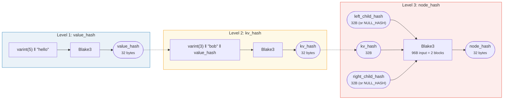

# 哈希 — 密码学完整性

Merk 树中的每个节点都经过哈希处理，产生一个**根哈希** — 一个 32 字节的值，用于认证整棵树。对任何键、值或结构关系的更改都会产生不同的根哈希。

## 三级哈希层次

Merk 使用三级哈希方案，从内到外依次为：

示例：key = `"bob"`（3 字节），value = `"hello"`（5 字节）：



> 树的根 = 根节点的 `node_hash` — 认证**每一个**键、值和结构关系。缺失的子节点使用 `NULL_HASH = [0x00; 32]`。

### 第 1 级：value_hash

```rust
// merk/src/tree/hash.rs
pub fn value_hash(value: &[u8]) -> CostContext<CryptoHash> {
    let mut hasher = blake3::Hasher::new();
    let val_length = value.len().encode_var_vec();  // Varint encoding
    hasher.update(val_length.as_slice());
    hasher.update(value);
    // ...
}
```

值的长度使用 **varint 编码**并前置。这对碰撞抗性至关重要 — 如果没有它，`H("AB" ‖ "C")` 将等于 `H("A" ‖ "BC")`。

### 第 2 级：kv_hash

```rust
pub fn kv_hash(key: &[u8], value: &[u8]) -> CostContext<CryptoHash> {
    let mut hasher = blake3::Hasher::new();
    let key_length = key.len().encode_var_vec();
    hasher.update(key_length.as_slice());
    hasher.update(key);
    let vh = value_hash(value);
    hasher.update(vh.as_slice());  // Nested hash
    // ...
}
```

这将键与值绑定。对于证明验证，还有一个接受预计算 value_hash 的变体：

```rust
pub fn kv_digest_to_kv_hash(key: &[u8], value_hash: &CryptoHash) -> CostContext<CryptoHash>
```

这在验证者已经拥有 value_hash 时使用（例如，对于 value_hash 是组合哈希的子树）。

### 第 3 级：node_hash

```rust
pub fn node_hash(
    kv: &CryptoHash,
    left: &CryptoHash,
    right: &CryptoHash,
) -> CostContext<CryptoHash> {
    let mut hasher = blake3::Hasher::new();
    hasher.update(kv);       // 32 bytes
    hasher.update(left);     // 32 bytes
    hasher.update(right);    // 32 bytes — total 96 bytes
    // Always exactly 2 hash operations (96 bytes / 64-byte block = 2)
}
```

如果子节点不存在，其哈希为 **NULL_HASH** — 32 个零字节：

```rust
pub const NULL_HASH: CryptoHash = [0; HASH_LENGTH];  // [0u8; 32]
```

## Blake3 作为哈希函数

GroveDB 在所有哈希中使用 **Blake3**。关键特性：

- **256 位输出**（32 字节）
- **块大小**：64 字节
- **速度**：在现代硬件上比 SHA-256 快约 3 倍
- **流式处理**：可以增量输入数据

哈希操作开销根据处理了多少个 64 字节块来计算：

```rust
let hashes = 1 + (hasher.count() - 1) / 64;  // Number of hash operations
```

## 长度前缀编码用于碰撞抗性

每个变长输入都使用 **varint 编码**前缀其长度：


> **value_hash 输入**：`[varint(value.len)] [value bytes]`
> **kv_hash 输入**：`[varint(key.len)] [key bytes] [value_hash: 32 bytes]`

如果没有长度前缀，攻击者可以构造不同的键值对产生相同的摘要。长度前缀使这在密码学上不可行。

## 特殊元素的组合哈希

对于**子树**和**引用**，`value_hash` 不是简单的 `H(value)`。相反，它是一个**组合哈希**，将元素绑定到其目标：


> **子树：**将子 Merk 的根哈希绑定到父节点。**引用：**同时绑定引用路径和目标值。更改任一项都会改变根哈希。

`combine_hash` 函数：

```rust
pub fn combine_hash(hash_one: &CryptoHash, hash_two: &CryptoHash) -> CostContext<CryptoHash> {
    let mut hasher = blake3::Hasher::new();
    hasher.update(hash_one);   // 32 bytes
    hasher.update(hash_two);   // 32 bytes — total 64 bytes, exactly 1 hash op
    // ...
}
```

这使得 GroveDB 能够通过单个根哈希来认证整个层次结构 — 每个父树的子树元素的 value_hash 都包含子树的根哈希。

## ProvableCountTree 的聚合哈希

`ProvableCountTree` 节点在节点哈希中包含聚合计数：

```rust
pub fn node_hash_with_count(
    kv: &CryptoHash,
    left: &CryptoHash,
    right: &CryptoHash,
    count: u64,
) -> CostContext<CryptoHash> {
    let mut hasher = blake3::Hasher::new();
    hasher.update(kv);                        // 32 bytes
    hasher.update(left);                      // 32 bytes
    hasher.update(right);                     // 32 bytes
    hasher.update(&count.to_be_bytes());      // 8 bytes — total 104 bytes
    // Still exactly 2 hash ops (104 < 128 = 2 × 64)
}
```

这意味着计数的证明不需要揭示实际数据 — 计数已经嵌入到密码学承诺中。

---
