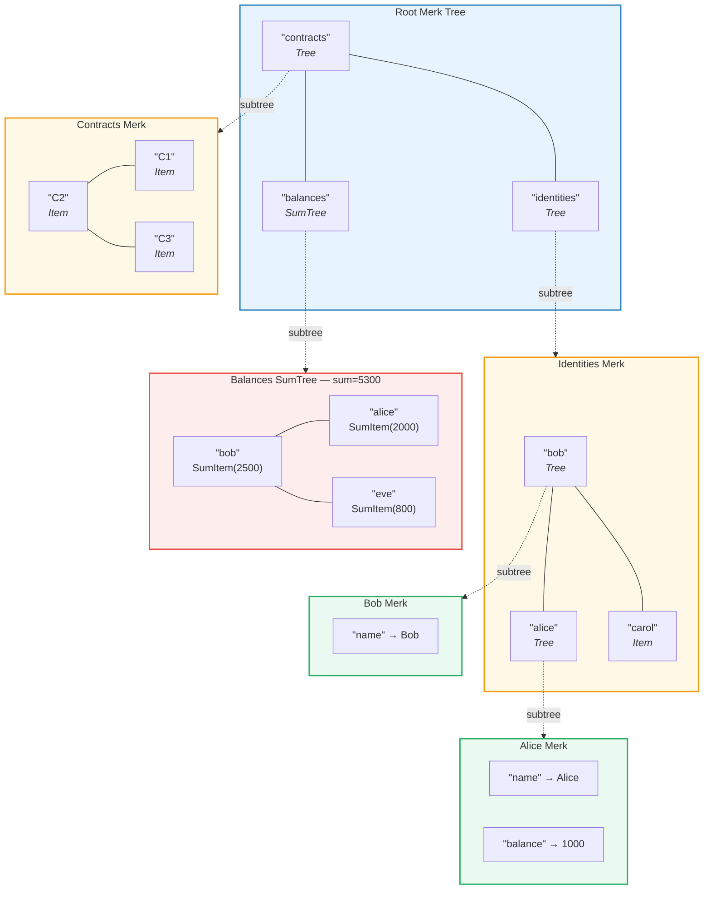
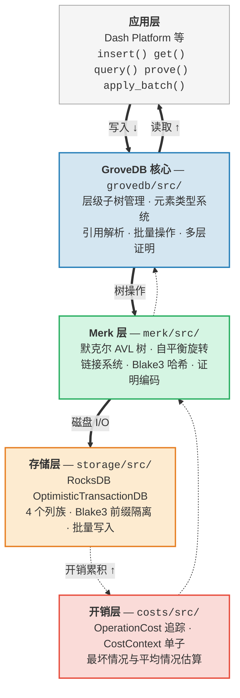

# 介绍 — 什么是 GroveDB？

## 核心理念

GroveDB 是一种**层级化的认证数据结构（hierarchical authenticated data structure）** — 本质上是一个基于 Merkle AVL tree（默克尔 AVL 树）构建的 *grove*（树丛，即树的树）。数据库中的每个节点都属于一棵密码学认证的树，而每棵树又可以包含其他树作为子树，从而形成一个深层的可验证状态层次结构。

> 每个彩色方框是一棵**独立的 Merk 树**。虚线箭头表示子树关系 — 父树中的 Tree 元素包含子 Merk 的根键。

在传统数据库中，你可能会将数据存储在一个扁平的键值存储中，并在顶部放置一棵默克尔树用于认证。GroveDB 采用了不同的方式：它将默克尔树嵌套在默克尔树中。这带来了以下优势：

1. **高效的二级索引** — 可以通过任意路径查询，而不仅仅是主键
2. **紧凑的密码学证明** — 证明任何数据的存在（或不存在）
3. **聚合数据** — 树可以自动对其子节点求和、计数或执行其他聚合操作
4. **跨树的原子操作** — 批量操作可以跨越多个子树

## 为什么创建 GroveDB

GroveDB 是为 **Dash Platform** 设计的，这是一个去中心化应用平台，其中每一条状态都必须满足以下要求：

- **可认证**：任何节点都能向轻客户端证明任何一条状态
- **确定性**：每个节点计算出完全相同的状态根
- **高效**：操作必须在出块时间约束内完成
- **可查询**：应用程序需要丰富的查询能力，而不仅仅是键查找

传统方案的不足：

| 方案 | 问题 |
|----------|---------|
| 普通默克尔树 | 只支持键查找，不支持范围查询 |
| 以太坊 MPT | 重平衡代价高昂，证明体积大 |
| 扁平键值存储 + 单棵树 | 不支持层级查询，单个证明覆盖所有内容 |
| B 树 | 天然不具备默克尔化特性，认证实现复杂 |

GroveDB 通过将 **AVL 树经过验证的平衡保证** 与 **层级嵌套** 和 **丰富的元素类型系统** 相结合来解决这些问题。

## 架构概览

GroveDB 被组织为多个层次分明的层，每层有明确的职责：

数据在写入时**向下**流经这些层，在读取时**向上**流动。每个操作在遍历堆栈时都会累积开销，从而实现精确的资源计量。

---
