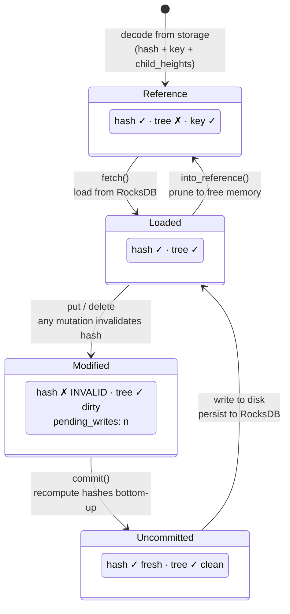
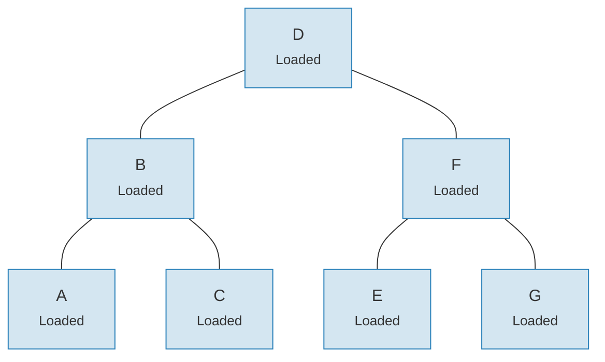
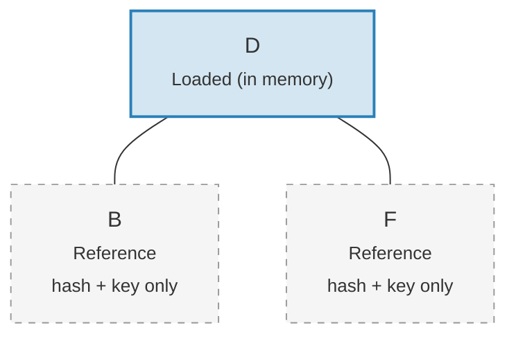

# 链接系统 — 延迟加载架构

将整棵 Merk 树加载到内存中对于大型树来说代价过高。链接系统通过将子节点连接表示为四种可能的状态来解决这个问题，实现了**延迟加载（lazy loading）** — 子节点仅在实际需要时才从存储中获取。

## 四种链接状态

```rust
// merk/src/tree/link.rs
pub enum Link {
    Reference {                    // Pruned: only metadata, no tree in memory
        hash: CryptoHash,
        child_heights: (u8, u8),
        key: Vec<u8>,
        aggregate_data: AggregateData,
    },
    Modified {                     // Recently changed, hash not yet computed
        pending_writes: usize,
        child_heights: (u8, u8),
        tree: TreeNode,
    },
    Uncommitted {                  // Hashed but not yet persisted to storage
        hash: CryptoHash,
        child_heights: (u8, u8),
        tree: TreeNode,
        aggregate_data: AggregateData,
    },
    Loaded {                       // Fully loaded from storage
        hash: CryptoHash,
        child_heights: (u8, u8),
        tree: TreeNode,
        aggregate_data: AggregateData,
    },
}
```

## 状态转换图



## 每种状态存储的内容

| 状态 | 有哈希？ | 树在内存中？ | 用途 |
|-------|-------|-----------------|---------|
| **Reference** | 是 | 否 | 紧凑的磁盘表示。仅存储键、哈希、子节点高度和聚合数据。 |
| **Modified** | 否 | 是 | 任何变更后的状态。跟踪 `pending_writes` 计数用于批量优化。 |
| **Uncommitted** | 是 | 是 | 哈希计算完成但尚未写入存储。提交过程中的中间状态。 |
| **Loaded** | 是 | 是 | 完全物化。可用于读取或进一步修改。 |

`Modified` 中的 `pending_writes` 字段值得注意：

```rust
// Computed as: 1 + left_pending_writes + right_pending_writes
pending_writes: 1 + tree.child_pending_writes(true)
                  + tree.child_pending_writes(false),
```

此计数帮助提交阶段决定如何排序写入以获得最佳性能。

## Fetch 回调模式

链接系统使用 **Fetch trait** 来抽象子节点的加载方式：

```rust
pub trait Fetch {
    fn fetch(
        &self,
        link: &Link,
        value_defined_cost_fn: Option<&impl Fn(&[u8], &GroveVersion) -> Option<ValueDefinedCostType>>,
        grove_version: &GroveVersion,
    ) -> CostResult<TreeNode, Error>;
}
```

不同的 fetch 实现服务于不同的目的：

- **StorageFetch**：从 RocksDB 加载（正常路径）
- **PanicSource**：用于不应发生 fetch 的测试场景
- **MockSource**：返回受控的测试数据

这种模式使树操作**与存储无关** — 相同的平衡和变更逻辑无论数据来自何处都能工作。

## Walker 模式

`Walker` 用 `Fetch` 源包装 `TreeNode`，提供带自动延迟加载的安全树遍历（`merk/src/tree/walk/mod.rs`）：

```rust
pub struct Walker<S: Fetch + Sized + Clone> {
    tree: Owner<TreeNode>,
    source: S,
}
```

Walker 提供三个关键操作：

**walk()** — 分离子节点、转换它、重新附加：

```rust
pub fn walk<F, T>(self, left: bool, f: F, ...) -> CostResult<Self, Error>
where
    F: FnOnce(Option<Self>) -> CostResult<Option<T>, Error>,
    T: Into<TreeNode>,
```

**detach()** — 移除子节点，如有必要从存储中加载：

```rust
pub fn detach(self, left: bool, ...) -> CostResult<(Self, Option<Self>), Error>
```

如果子节点是 `Link::Reference`（已裁剪），detach 将调用 `fetch()` 先加载它。如果子节点已在内存中（`Modified`、`Uncommitted`、`Loaded`），则简单地取得所有权。

**attach()** — 将子节点连接到父节点：

```rust
pub fn attach(self, left: bool, maybe_child: Option<Self>) -> Self
```

附加操作总是创建一个 `Link::Modified`，因为父子关系已经改变。

## 通过裁剪实现内存效率

提交更改后，树可以将已加载的子树**裁剪**回 `Link::Reference`，释放内存的同时保留证明生成所需的哈希：

**裁剪前** — 所有 7 个节点在内存中：



**裁剪后** — 仅根节点在内存中，子节点为 `Link::Reference`（仅哈希 + 键）：



> **Link::Loaded** 持有 `hash + child_heights + tree (TreeNode)`。**Link::Reference** 仅持有 `hash + child_heights + key` — TreeNode 从内存中释放。

转换很简单：

```rust
pub fn into_reference(self) -> Link {
    Link::Reference {
        hash: self.hash(),
        child_heights: self.child_heights(),
        key: self.key().to_vec(),
        aggregate_data: self.aggregate_data(),
    }
}
```

这对于控制大型树的内存使用至关重要 — 只有正在被访问的节点才需要在内存中。

---
