# Merk 树 — 默克尔 AVL 树

Merk 树是 GroveDB 的基础构建模块。树丛中的每棵子树都是一棵 Merk 树 — 一棵自平衡二叉搜索树，其中每个节点都经过密码学哈希，产生一个单一的根哈希来认证整棵树的内容。

## 什么是 Merk 节点？

与许多数据仅存储在叶节点的默克尔树实现不同，在 Merk 树中**每个节点都存储一个键值对**。这意味着没有"空的"内部节点 — 该树同时是搜索结构和数据存储。

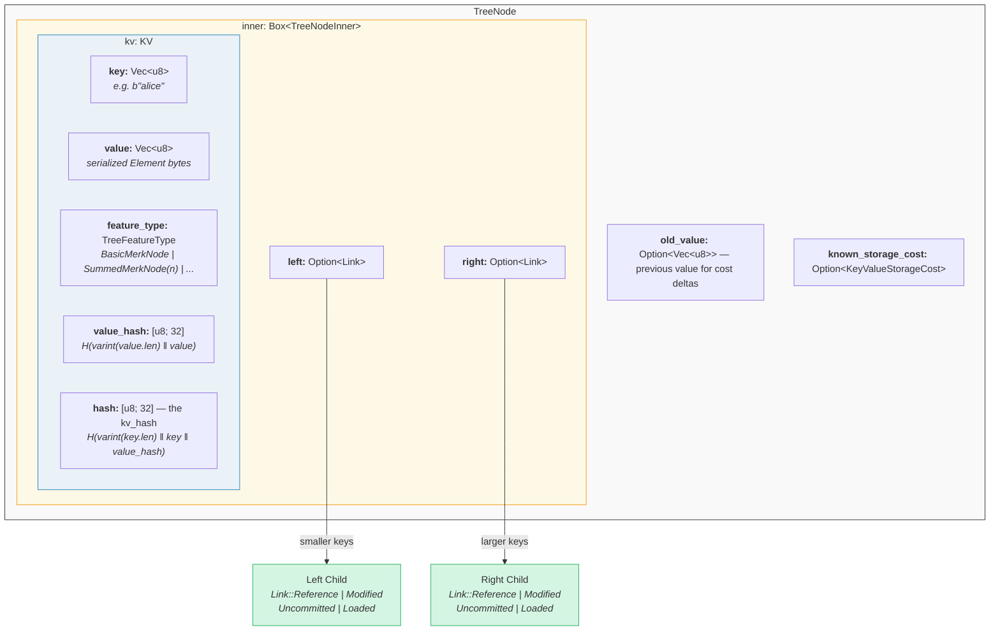

代码中（`merk/src/tree/mod.rs`）：

```rust
pub struct TreeNode {
    pub(crate) inner: Box<TreeNodeInner>,
    pub(crate) old_value: Option<Vec<u8>>,        // Previous value for cost tracking
    pub(crate) known_storage_cost: Option<KeyValueStorageCost>,
}

pub struct TreeNodeInner {
    pub(crate) left: Option<Link>,    // Left child (smaller keys)
    pub(crate) right: Option<Link>,   // Right child (larger keys)
    pub(crate) kv: KV,               // The key-value payload
}
```

`Box<TreeNodeInner>` 将节点保持在堆上，这很重要，因为子链接可以递归地包含完整的 `TreeNode` 实例。

## KV 结构

`KV` 结构体同时持有原始数据及其密码学摘要（`merk/src/tree/kv.rs`）：

```rust
pub struct KV {
    pub(super) key: Vec<u8>,                        // The lookup key
    pub(super) value: Vec<u8>,                      // The stored value
    pub(super) feature_type: TreeFeatureType,       // Aggregation behavior
    pub(crate) value_defined_cost: Option<ValueDefinedCostType>,
    pub(super) hash: CryptoHash,                    // kv_hash
    pub(super) value_hash: CryptoHash,              // H(value)
}
```

两个要点：

1. **键不作为编码节点的一部分存储在磁盘上。** 它们作为 RocksDB 的键存储。当从存储解码节点时，键从外部注入。这避免了键字节的重复。

2. **维护两个哈希字段。** `value_hash` 是 `H(value)`，`hash`（kv_hash）是 `H(key, value_hash)`。保留两者使证明系统可以选择揭示多少信息。

## 半平衡特性 — AVL 如何"摇摆"

Merk 树是一棵 **AVL 树** — 由 Adelson-Velsky 和 Landis 发明的经典自平衡二叉搜索树。核心不变量是：

> 对于每个节点，其左右子树的高度差至多为 1。

这表示为**平衡因子（balance factor）**：

```text
balance_factor = right_height - left_height
```

有效值：**{-1, 0, 1}**

```rust
// merk/src/tree/mod.rs
pub const fn balance_factor(&self) -> i8 {
    let left_height = self.child_height(true) as i8;
    let right_height = self.child_height(false) as i8;
    right_height - left_height
}
```

但这里有个微妙之处：虽然每个单独的节点只能倾斜一级，但这些倾斜可以在树中**复合累积**。这就是为什么我们称之为"半平衡" — 该树不像完全二叉树那样完美平衡。

考虑一棵包含 10 个节点的树。完美平衡的树高度为 4（⌈log₂(10+1)⌉），但 AVL 树的高度可能为 5：

**完美平衡（高度 4）** — 每层完全填满：

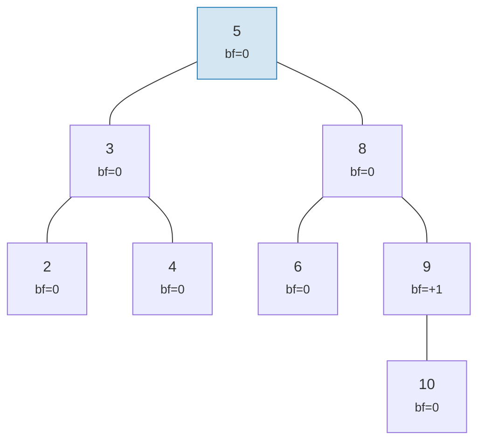

**AVL 有效的"摇摆"（高度 5）** — 每个节点最多倾斜 1，但会复合累积：

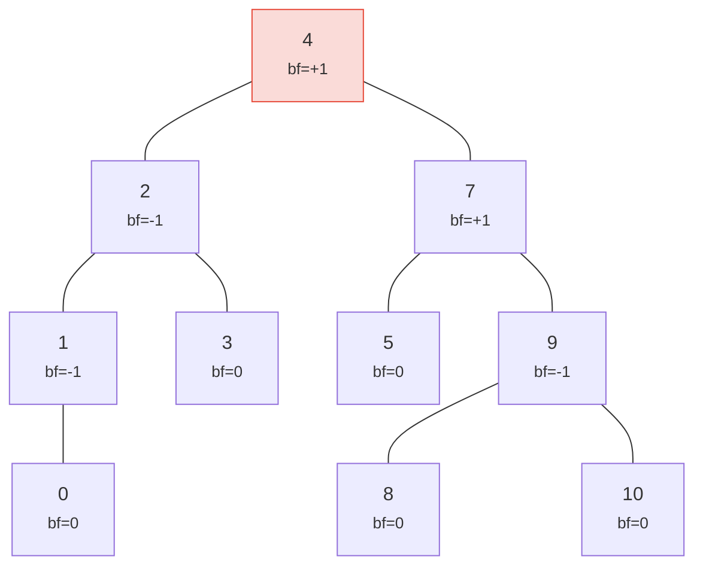

> 高度 5 对比完美的 4 — 这就是"摇摆"。最坏情况：h ≤ 1.44 × log₂(n+2)。

两棵树都是有效的 AVL 树！AVL 树的最坏情况高度为：

```text
h ≤ 1.4404 × log₂(n + 2) − 0.3277
```

因此对于 **n = 1,000,000** 个节点：
- 完美平衡：高度 20
- AVL 最坏情况：高度 ≈ 29

这 ~44% 的开销是 AVL 简单旋转规则的代价。在实践中，随机插入产生的树更接近完美平衡。

以下是有效和无效树的示例：

**有效** — 所有平衡因子在 {-1, 0, +1} 范围内：

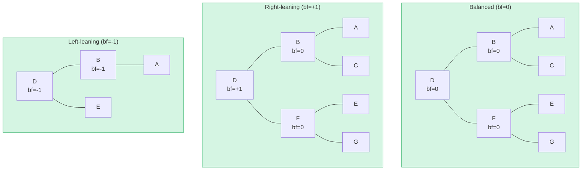

**无效** — 平衡因子 = +2（需要旋转！）：

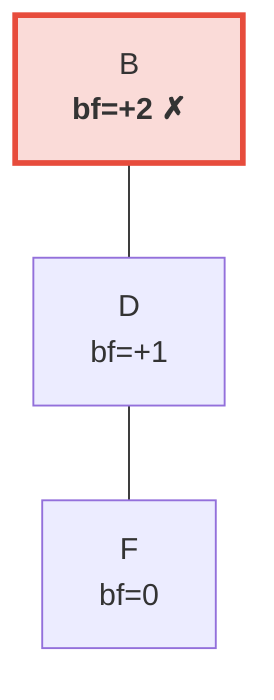

> 右子树比左子树（为空）高 2 级。这会触发**左旋转**以恢复 AVL 不变量。

## 旋转 — 恢复平衡

当插入或删除导致平衡因子达到 ±2 时，必须对树进行**旋转**以恢复 AVL 不变量。共有四种情况，可以归纳为两种基本操作。

### 单左旋转

当节点**右偏重**（bf = +2）且其右子节点**右偏重或平衡**（bf ≥ 0）时使用：

**旋转前**（bf=+2）：

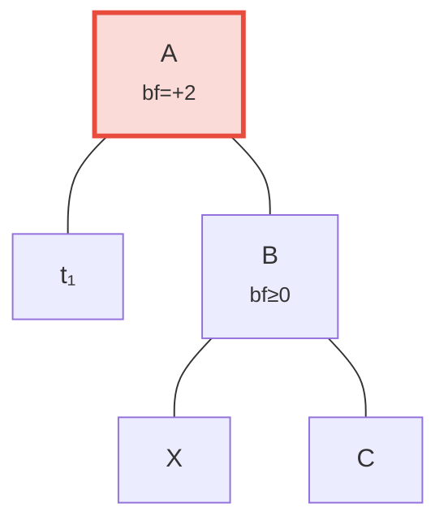

**旋转后** — B 提升为根：

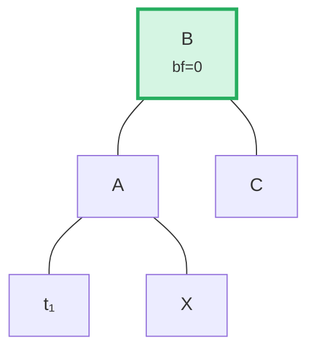

> **步骤：** (1) 将 B 从 A 分离。 (2) 分离 X（B 的左子节点）。 (3) 将 X 作为 A 的右子节点附加。 (4) 将 A 作为 B 的左子节点附加。以 B 为根的子树现在是平衡的。

代码中（`merk/src/tree/ops.rs`）：

```rust
fn rotate<V>(self, left: bool, ...) -> CostResult<Self, Error> {
    // Detach child on the heavy side
    let (tree, child) = self.detach_expect(left, ...);
    // Detach grandchild from opposite side of child
    let (child, maybe_grandchild) = child.detach(!left, ...);

    // Attach grandchild to original root
    tree.attach(left, maybe_grandchild)
        .maybe_balance(...)
        .flat_map_ok(|tree| {
            // Attach original root as child of promoted node
            child.attach(!left, Some(tree))
                .maybe_balance(...)
        })
}
```

注意 `maybe_balance` 是递归调用的 — 旋转本身可能会产生需要进一步修正的新不平衡。

### 双旋转（左-右）

当节点**左偏重**（bf = -2）但其左子节点**右偏重**（bf > 0）时使用。单次旋转无法修复此情况：

**步骤 0：旋转前** — C 左偏重（bf=-2），但其左子节点 A 右倾（bf=+1）。单次旋转无法修复：

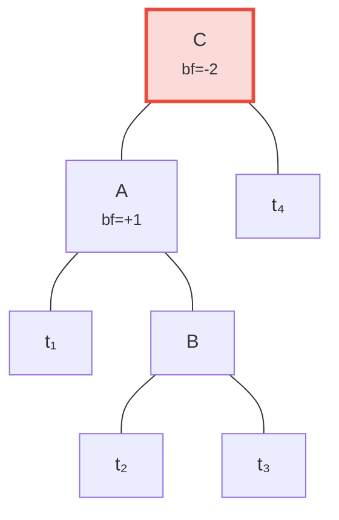

**步骤 1：对子节点 A 左旋** — 现在 C 和 B 都左倾，可以通过单次旋转修复：

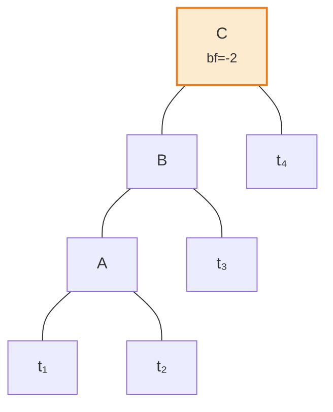

**步骤 2：对根节点 C 右旋** — 平衡！

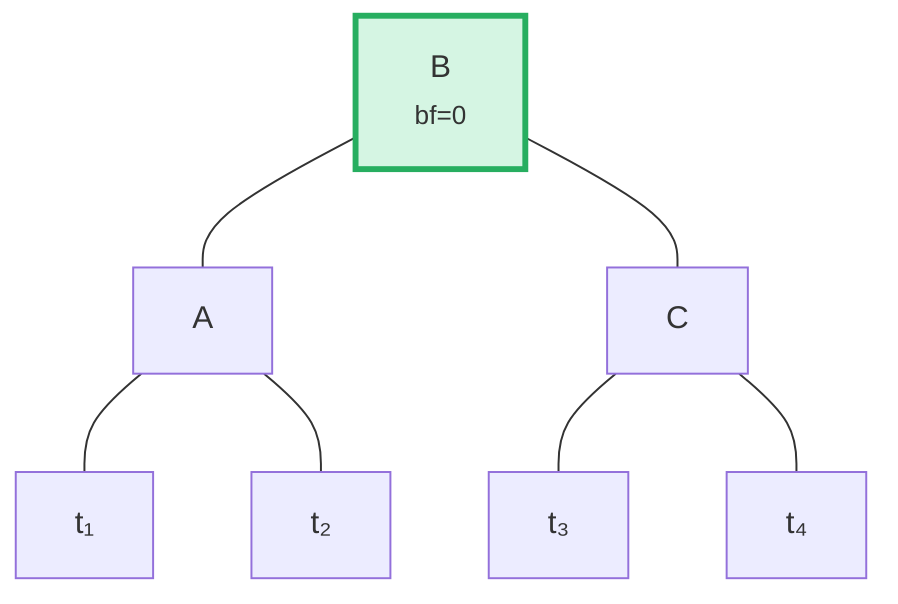

算法通过比较父节点的倾斜方向与子节点的平衡因子来检测这种情况：

```rust
fn maybe_balance<V>(self, ...) -> CostResult<Self, Error> {
    let balance_factor = self.balance_factor();
    if balance_factor.abs() <= 1 {
        return Ok(self);  // Already balanced
    }

    let left = balance_factor < 0;  // true if left-heavy

    // Double rotation needed when child leans opposite to parent
    let tree = if left == (self.tree().link(left).unwrap().balance_factor() > 0) {
        // First rotation: rotate child in opposite direction
        self.walk_expect(left, |child|
            child.rotate(!left, ...).map_ok(Some), ...
        )
    } else {
        self
    };

    // Second (or only) rotation
    tree.rotate(left, ...)
}
```

## 批量操作 — 构建与应用

Merk 支持批量操作，将多个更改在一次遍历中应用，而不是逐个插入元素。这对效率至关重要：对一棵包含 M 个元素的树执行 N 个操作的批处理需要 **O((M + N) log(M + N))** 时间，而顺序插入则需要 O(N log M)。

### MerkBatch 类型

```rust
type MerkBatch<K> = [(K, Op)];

enum Op {
    Put(Vec<u8>, TreeFeatureType),  // Insert or update with value and feature type
    PutWithSpecializedCost(...),     // Insert with predefined cost
    PutCombinedReference(...),       // Insert reference with combined hash
    Replace(Vec<u8>, TreeFeatureType),
    Patch { .. },                    // Partial value update
    Delete,                          // Remove key
    DeleteLayered,                   // Remove with layered cost
    DeleteMaybeSpecialized,          // Remove with optional specialized cost
}
```

### 策略 1：build() — 从头构建

当树为空时，`build()` 使用**中位数分割**算法直接从排序后的批次构建平衡树：

输入批次（已排序）：`[A, B, C, D, E, F, G]` — 选择中间元素（D）作为根，对每一半递归：

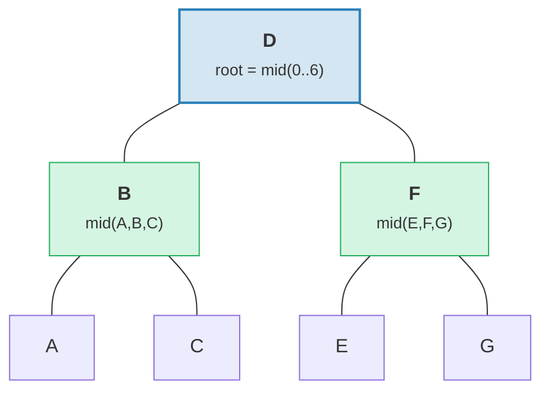

> 结果：完美平衡的树，高度 = 3 = ⌈log₂(7)⌉。

```rust
fn build(batch: &MerkBatch<K>, ...) -> CostResult<Option<TreeNode>, Error> {
    let mid_index = batch.len() / 2;
    let (mid_key, mid_op) = &batch[mid_index];

    // Create root node from middle element
    let mid_tree = TreeNode::new(mid_key.clone(), value.clone(), None, feature_type)?;

    // Recursively build left and right subtrees
    let left = Self::build(&batch[..mid_index], ...);
    let right = Self::build(&batch[mid_index + 1..], ...);

    // Attach children
    mid_tree.attach(true, left).attach(false, right)
}
```

这会产生高度为 ⌈log₂(n)⌉ 的树 — 完美平衡。

### 策略 2：apply_sorted() — 合并到现有树

当树中已有数据时，`apply_sorted()` 使用**二分搜索**找到每个批量操作所属的位置，然后递归地将操作应用到左右子树：

现有树与批次 `[(B, Put), (F, Delete)]`：

二分搜索：B < D（向左），F > D（向右）。

**之前：**
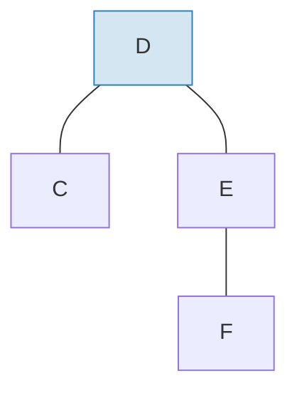

**之后** — 应用批次并重新平衡：
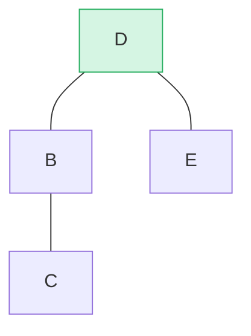

> B 插入为左子树，F 从右子树删除。`maybe_balance()` 确认 bf(D) = 0。

```rust
fn apply_sorted(self, batch: &MerkBatch<K>, ...) -> CostResult<...> {
    let search = batch.binary_search_by(|(key, _)| key.cmp(self.tree().key()));

    match search {
        Ok(index) => {
            // Key matches this node — apply operation directly
            // (Put replaces value, Delete removes node)
        }
        Err(mid) => {
            // Key not found — mid is the split point
            // Recurse on left_batch[..mid] and right_batch[mid..]
        }
    }

    self.recurse(batch, mid, exclusive, ...)
}
```

`recurse` 方法分割批次并遍历左右子树：

```rust
fn recurse(self, batch: &MerkBatch<K>, mid: usize, ...) {
    let left_batch = &batch[..mid];
    let right_batch = &batch[mid..];  // or mid+1 if exclusive

    // Apply left batch to left subtree
    let tree = self.walk(true, |maybe_left| {
        Self::apply_to(maybe_left, left_batch, ...)
    });

    // Apply right batch to right subtree
    let tree = tree.walk(false, |maybe_right| {
        Self::apply_to(maybe_right, right_batch, ...)
    });

    // Re-balance after modifications
    tree.maybe_balance(...)
}
```

### 节点删除

当删除具有两个子节点的节点时，Merk 会从较高子树中提升**边缘节点**。这最大限度地减少了需要额外旋转的可能性：

**之前** — 删除 D（有两个子节点，右子树高度 ≥ 左子树）：

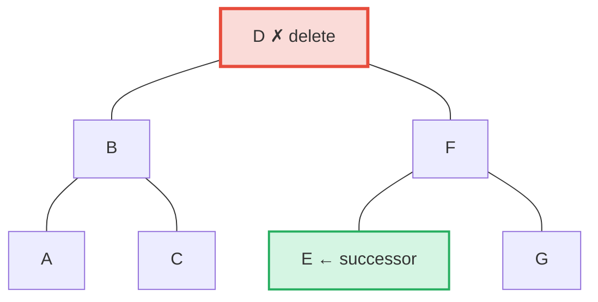

**之后** — E（右子树中最左节点 = 中序后继）提升到 D 的位置：

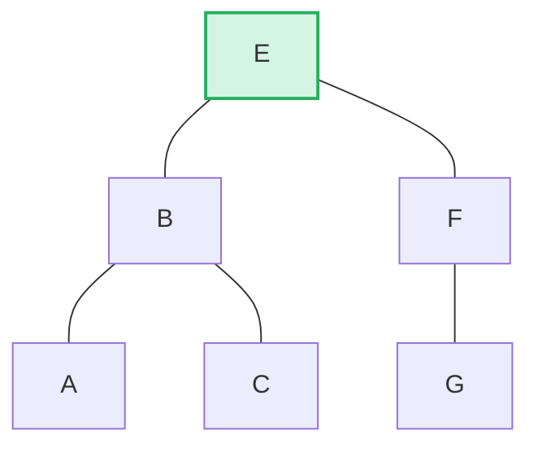

> **规则：** 如果左高度 > 右高度 → 提升左子树的右边缘。如果右高度 ≥ 左高度 → 提升右子树的左边缘。这最大限度地减少了删除后的重平衡操作。

```rust
pub fn remove(self, ...) -> CostResult<Option<Self>, Error> {
    let has_left = tree.link(true).is_some();
    let has_right = tree.link(false).is_some();
    let left = tree.child_height(true) > tree.child_height(false);

    if has_left && has_right {
        // Two children: promote edge of taller child
        let (tree, tall_child) = self.detach_expect(left, ...);
        let (_, short_child) = tree.detach_expect(!left, ...);
        tall_child.promote_edge(!left, short_child, ...)
    } else if has_left || has_right {
        // One child: promote it directly
        self.detach_expect(left, ...).1
    } else {
        // Leaf node: just remove
        None
    }
}
```

---
