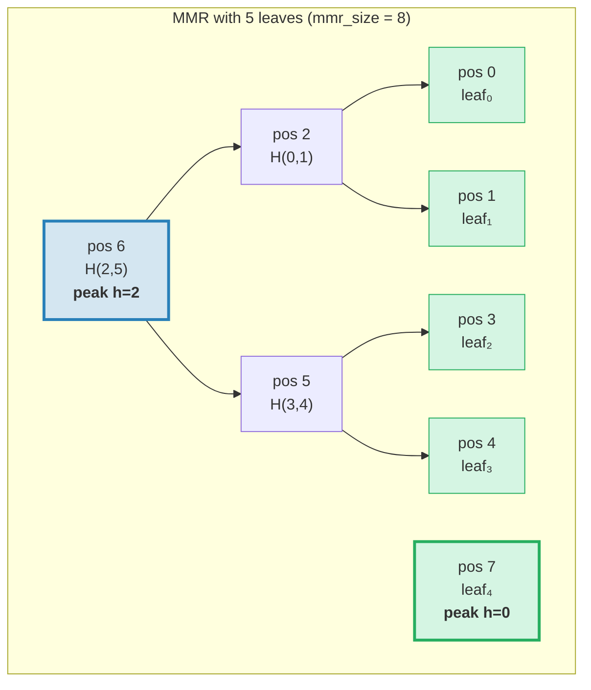
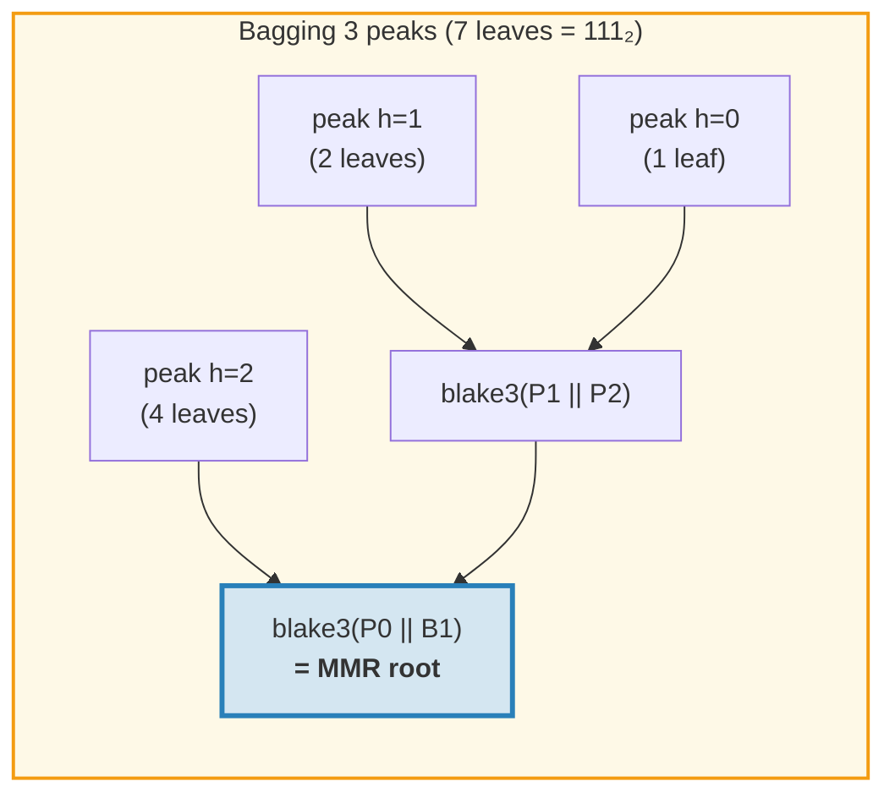
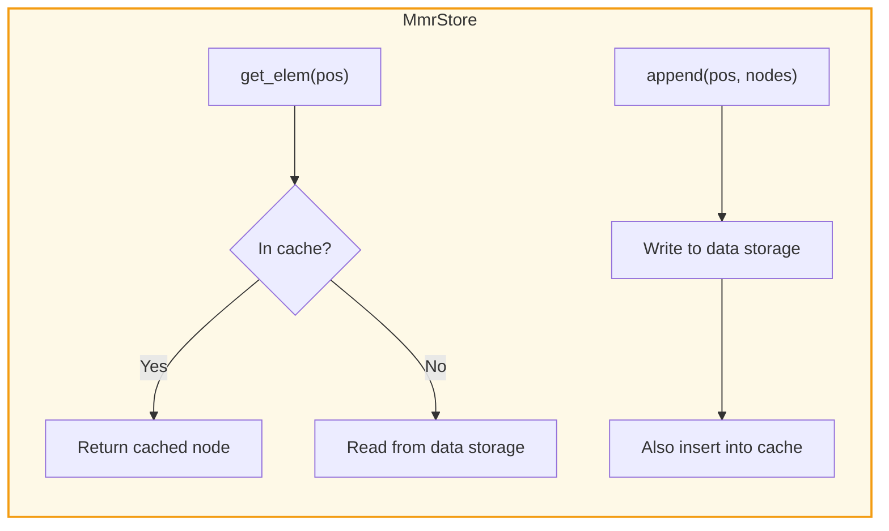
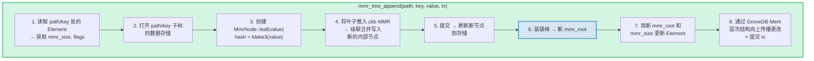
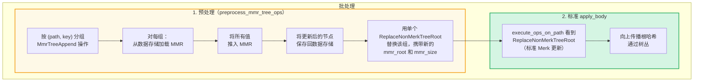
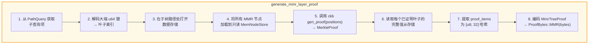
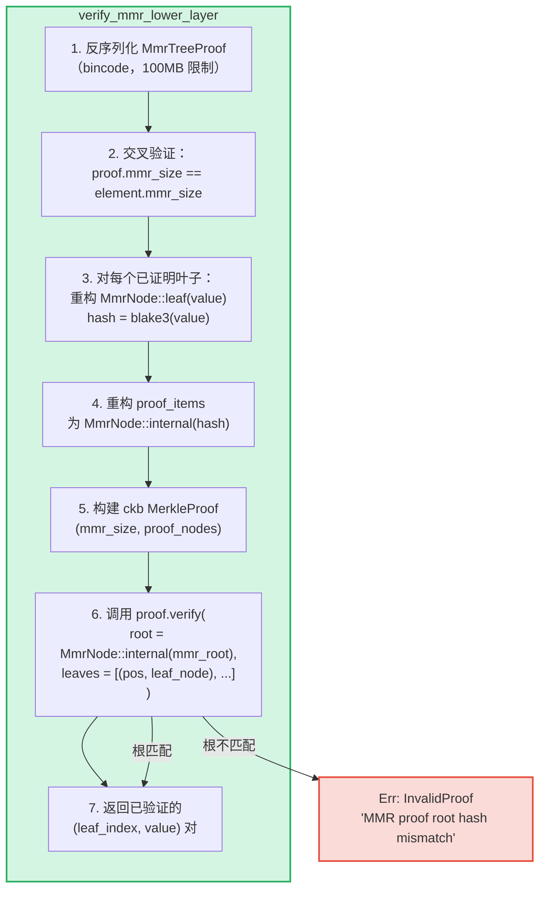

# MMR 树 — 仅追加认证日志

**MmrTree** 是 GroveDB 的仅追加认证数据结构，基于使用 Blake3 哈希的 Merkle Mountain Range（MMR，默克尔山脉）构建。虽然 Merk AVL 树（第 2 章）擅长随机键值操作且更新复杂度为 O(log N)，但 MMR 专为仅追加场景而设计：零旋转、每次追加的摊销哈希开销为 O(1)，以及顺序 I/O 模式。

本章深入介绍 MMR 数据结构 — 它如何增长、节点如何存储、追加如何级联，以及证明系统如何让任何第三方验证特定值在特定位置被追加。

## 为什么需要单独的树类型？

GroveDB 的标准 Merk 树能很好地处理有序键值数据，但仅追加日志有不同的需求：

| 属性 | Merk AVL 树 | MMR |
|----------|--------------|-----|
| 操作 | 插入、更新、删除 | 仅追加 |
| 重平衡 | 每次写入 O(log N) 次旋转 | 无 |
| I/O 模式 | 随机（重平衡触及许多节点） | 顺序（新节点总在末尾） |
| N 次插入的总哈希数 | O(N log N) | O(N) |
| 结构 | 由插入顺序决定 | 仅由叶子数量决定 |
| 证明 | 从根到叶的路径 | 兄弟 + 峰哈希 |

对于事务日志、事件流或任何单调增长的数据等用例，MMR 严格优于 Merk：更简单、更快、更可预测。

## MMR 数据结构

MMR 是一个**完美二叉树的森林**（称为"peaks"，即峰），从左到右增长。每个峰是一棵某高度 *h* 的完全二叉树，恰好包含 2^h 个叶子。

关键洞察：**叶子数量的二进制表示决定了峰的结构**。二进制形式中的每个 1 位对应一个峰：

```text
Leaf count    Binary    Peaks
─────────     ──────    ─────
1             1         one peak h=0
2             10        one peak h=1
3             11        peaks h=1, h=0
4             100       one peak h=2
5             101       peaks h=2, h=0
6             110       peaks h=2, h=1
7             111       peaks h=2, h=1, h=0
8             1000      one peak h=3
```

这意味着 MMR 结构完全由单个数字 — 叶子数量决定。具有相同叶子数量的两个 MMR 始终具有相同的形状，无论追加了什么值。

## MMR 如何填充

MMR 中的每个节点都有一个**位置**（从 0 开始）。叶子和内部节点按特定模式交错。以下是逐步增长过程：

**1 个叶子后（mmr_size = 1）：**
```text
pos:  0
      leaf₀        ← one peak at height 0
```

**2 个叶子后（mmr_size = 3）：**
```text
pos:     2          ← internal: blake3(leaf₀.hash || leaf₁.hash)
        / \
       0   1        ← leaves

One peak at height 1. Positions 0 and 1 are leaves, position 2 is internal.
```
当 leaf₁ 被追加时，它创建了一个高度 0 的峰。但已有一个高度 0 的峰（leaf₀），所以它们**合并**成一个高度 1 的峰。

**3 个叶子后（mmr_size = 4）：**
```text
pos:     2     3    ← peak h=1, peak h=0
        / \
       0   1

Two peaks. No merge — heights 1 and 0 are different.
(Binary: 3 = 11₂ → one peak per 1-bit)
```

**4 个叶子后（mmr_size = 7）：**
```text
pos:         6              ← internal: merge of nodes 2 and 5
           /   \
         2       5          ← internal nodes
        / \     / \
       0   1   3   4        ← leaves

One peak at height 2.
```
这是有趣的地方。追加 leaf₃（位置 4）创建 node₅（合并位置 3 和 4）。但现在 node₅（高度 1）和 node₂（高度 1）是等高相邻的峰，所以它们合并成 node₆。**单次追加产生两次合并级联。**

**5 个叶子后（mmr_size = 8）：**
```text
pos:         6         7    ← peak h=2, peak h=0
           /   \
         2       5
        / \     / \
       0   1   3   4

Two peaks. (Binary: 5 = 101₂)
```

**7 个叶子后（mmr_size = 11）：**
```text
pos:         6         10    ← peak h=2, peak h=1, peak h=0
           /   \      / \
         2       5   8   9    7
        / \     / \
       0   1   3   4

Three peaks. (Binary: 7 = 111₂)
```

**8 个叶子后（mmr_size = 15）：**
```text
pos:              14                     ← single peak h=3
               /      \
            6            13
          /   \        /    \
        2       5    9       12
       / \     / \  / \     / \
      0   1   3  4 7   8  10  11

One peak at height 3. Three cascading merges from appending leaf₇.
```



> **蓝色** = 峰（完美二叉子树的根）。**绿色** = 叶节点。

## 合并级联

当追加新叶子时，可能触发一系列合并。合并次数等于当前叶子数量二进制表示中**尾随 1 位**的数量：

| 叶子数量（推入前） | 二进制 | 尾随 1 数 | 合并次数 | 总哈希数 |
|--------------------------|--------|-------------|--------|--------------|
| 0 | `0` | 0 | 0 | 1（仅叶子） |
| 1 | `1` | 1 | 1 | 2 |
| 2 | `10` | 0 | 0 | 1 |
| 3 | `11` | 2 | 2 | 3 |
| 4 | `100` | 0 | 0 | 1 |
| 5 | `101` | 1 | 1 | 2 |
| 6 | `110` | 0 | 0 | 1 |
| 7 | `111` | 3 | 3 | 4 |

**每次推入的总哈希数** = `1 + trailing_ones(leaf_count)`：
- 叶子本身 1 次哈希：`blake3(value)`
- 合并级联 N 次哈希：每次合并 `blake3(left.hash || right.hash)`

这是 GroveDB 追踪每次追加哈希开销的方式。实现：
```rust
pub fn hash_count_for_push(leaf_count: u64) -> u32 {
    1 + leaf_count.trailing_ones()
}
```

## MMR 大小与叶子数量

MMR 在平坦的位置空间中同时存储叶子和内部节点，因此 `mmr_size` 始终大于叶子数量。精确关系为：

```text
mmr_size = 2 * leaf_count - popcount(leaf_count)
```

其中 `popcount` 是 1 位的数量（即峰的数量）。每个内部节点合并两个子树，每次合并减少一个节点计数。

反向计算 — 从 mmr_size 得到叶子数量 — 使用峰位置：

```rust
fn mmr_size_to_leaf_count(mmr_size: u64) -> u64 {
    // Each peak at height h contains 2^h leaves
    get_peaks(mmr_size).iter()
        .map(|&peak_pos| 1u64 << pos_height_in_tree(peak_pos))
        .sum()
}
```

| mmr_size | leaf_count | peaks |
|----------|-----------|-------|
| 0 | 0 | （空） |
| 1 | 1 | h=0 |
| 3 | 2 | h=1 |
| 4 | 3 | h=1, h=0 |
| 7 | 4 | h=2 |
| 8 | 5 | h=2, h=0 |
| 10 | 6 | h=2, h=1 |
| 11 | 7 | h=2, h=1, h=0 |
| 15 | 8 | h=3 |

GroveDB 在 Element 中存储 `mmr_size`（而非叶子数量），因为 ckb MMR 库内部使用位置。`mmr_tree_leaf_count` 操作动态推导叶子数量。

## MMR 根哈希 — 峰的装袋

MMR 有多个峰（叶子数量中每个 1 位对应一个）。为了产生单个 32 字节根哈希，峰从右到左**"装袋"**：

```text
root = bag_rhs_peaks(peaks):
    start with rightmost peak
    fold leftward: blake3(left_peak || accumulated_right)
```

有 1 个峰时，根就是该峰的哈希。有 3 个峰时：



> 根哈希随**每次**追加而变化，即使没有合并发生，因为最右侧的峰发生了变化，装袋必须重新计算。

## 节点结构和序列化

每个 MMR 节点是一个 `MmrNode`：

```rust
struct MmrNode {
    hash: [u8; 32],           // Blake3 hash
    value: Option<Vec<u8>>,   // Some for leaves, None for internal nodes
}
```

**叶节点：** `hash = blake3(value_bytes)`, `value = Some(value_bytes)`
**内部节点：** `hash = blake3(left.hash || right.hash)`, `value = None`

合并函数很直接 — 连接两个 32 字节哈希并做 Blake3 运算：

```rust
fn blake3_merge(left: &[u8; 32], right: &[u8; 32]) -> [u8; 32] {
    let mut input = [0u8; 64];
    input[..32].copy_from_slice(left);
    input[32..].copy_from_slice(right);
    *blake3::hash(&input).as_bytes()
}
```

> **关于 PartialEq 的说明：** `MmrNode` 实现的 `PartialEq` 仅比较**哈希字段**，不比较值。这对证明验证至关重要：ckb 验证器将重构的根（value = None）与预期根比较。如果 PartialEq 比较值字段，单叶 MMR 证明将始终失败，因为叶子有 `value: Some(...)`，但根重构产生 `value: None`。

**序列化格式：**
```text
Internal: [0x00] [hash: 32 bytes]                                = 33 bytes
Leaf:     [0x01] [hash: 32 bytes] [value_len: 4 BE] [value...]   = 37 + len bytes
```

标志字节区分内部节点和叶子。反序列化验证精确长度 — 不允许尾随字节。

## 存储架构

MmrTree 将其节点存储在**数据**列（与 Merk 节点使用的同一列族）中，而不是子 Merk 子树中。Element 没有 `root_key` 字段 — MMR 根哈希通过 `insert_subtree(subtree_root_hash)` 作为 Merk **子哈希**流动，认证 MMR 状态。

**存储键**基于位置：
```text
key = 'm' || position_as_be_u64    (9 bytes: prefix + u64 BE)
```

因此位置 42 存储在键 `[0x6D, 0x00, 0x00, 0x00, 0x00, 0x00, 0x00, 0x00, 0x2A]`。

查找叶子 *i* 需要先计算 MMR 位置：`pos = leaf_index_to_pos(i)`，然后读取数据键 `m{pos}`。

**写穿缓存：** 在追加期间，新写入的节点必须立即可读以供同一次推入中的后续合并使用。因为 GroveDB 的事务存储将写入延迟到批次中（它们在提交前不可读），`MmrStore` 适配器用内存 `HashMap` 缓存包装存储上下文：



这确保当追加 leaf₃ 触发合并级联（在位置 5 和 6 创建内部节点）时，node₅ 在计算 node₆ 时立即可用，即使 node₅ 尚未提交到 RocksDB。

**根哈希传播到 GroveDB 状态根：**

```text
combined_value_hash = blake3(
    blake3(varint(len) || element_bytes),   ← value_hash from serialized Element
    mmr_root_hash                           ← child_hash = type-specific root
)
```

MMR 根哈希通过 `insert_subtree` 作为 Merk 子哈希流动。MMR 状态的任何更改都会产生不同的 `combined_value_hash`，它通过父 Merk 层次结构一路传播到 GroveDB 状态根。

## GroveDB 操作

MmrTree 提供四个操作：

```rust
// Append a value — returns (new_mmr_root, leaf_index)
db.mmr_tree_append(path, key, value, tx, version)

// Read the current root hash (from Element, no storage access)
db.mmr_tree_root_hash(path, key, tx, version)

// Get a leaf value by 0-based index
db.mmr_tree_get_value(path, key, leaf_index, tx, version)

// Get the number of leaves appended
db.mmr_tree_leaf_count(path, key, tx, version)
```

### 追加流程

追加操作最为复杂，执行 8 个步骤：



步骤 4 可能写入 1 个节点（仅叶子）或 1 + N 个节点（叶子 + N 个内部合并节点）。步骤 5 调用 `mmr.commit()` 将 ckb MemStore 刷新到 MmrStore。步骤 7 调用 `insert_subtree`，以新的 MMR 根作为子哈希（通过 `subtree_root_hash`），因为 MmrTree 没有子 Merk。

### 读取操作

`mmr_tree_root_hash` 从存储中的 MMR 数据计算根。`mmr_tree_leaf_count` 从 Element 中的 `mmr_size` 推导叶子数量。不需要数据存储访问。

`mmr_tree_get_value` 计算 `pos = leaf_index_to_pos(leaf_index)`，读取 `m{pos}` 处的单个数据存储条目，反序列化 `MmrNode`，并返回 `node.value`。

## 批量操作

可以使用 `GroveOp::MmrTreeAppend { value }` 批量执行多个 MMR 追加。因为标准批处理的 `execute_ops_on_path` 函数只能访问 Merk（不能访问 MMR 的存储上下文），MMR 追加使用**预处理阶段**：



示例：一个包含 3 次追加到同一 MMR 的批次：
```rust
vec![
    QualifiedGroveDbOp { path: p, key: k, op: MmrTreeAppend { value: v1 } },
    QualifiedGroveDbOp { path: p, key: k, op: MmrTreeAppend { value: v2 } },
    QualifiedGroveDbOp { path: p, key: k, op: MmrTreeAppend { value: v3 } },
]
```

预处理加载 MMR 一次，推入 v1、v2、v3（创建所有中间节点），将所有内容保存到数据存储，然后发出一个携带最终 `mmr_root` 和 `mmr_size` 的 `ReplaceNonMerkTreeRoot`。标准批处理机制处理其余部分。

## 证明生成

MMR 证明是 **V1 证明** — 它们使用分层证明结构中的 `ProofBytes::MMR` 变体（参见 §9.6）。证明演示特定叶子值存在于 MMR 中的特定位置，且其哈希与存储在父元素中的 `mmr_root` 一致。

### 查询编码

查询键将位置编码为**大端 u64 字节**。这保持了字典序排序顺序（因为大端编码是单调的），使所有标准 `QueryItem` 变体都能工作：

```text
QueryItem::Key([0,0,0,0,0,0,0,5])            → leaf index 5
QueryItem::RangeInclusive([..2]..=[..7])      → leaf indices [2, 3, 4, 5, 6, 7]
QueryItem::RangeFrom([..10]..)                → leaf indices [10, 11, ..., N-1]
QueryItem::RangeFull                          → all leaves [0..leaf_count)
```

**10,000,000 个索引**的安全上限防止无限范围查询导致内存耗尽。空 MMR（零叶子）返回空证明。

### MmrTreeProof 结构

```rust
struct MmrTreeProof {
    mmr_size: u64,                 // MMR size at proof time
    leaves: Vec<(u64, Vec<u8>)>,   // (leaf_index, value) for each proved leaf
    proof_items: Vec<[u8; 32]>,    // Sibling/peak hashes for verification
}
```

`proof_items` 包含从已证明叶子到 MMR 根重构路径所需的最少哈希集。这些是每一级的兄弟节点和未涉及的峰哈希。

### 生成流程



步骤 4 使用 `MemNodeStore` — 一个只读 BTreeMap，从数据存储预加载所有 MMR 节点。ckb 证明生成器需要随机访问，因此所有节点必须在内存中。

步骤 5 是 ckb 库执行繁重工作的地方：给定 MMR 大小和要证明的位置，它确定需要哪些兄弟和峰哈希。

### 工作示例

**在 5 叶 MMR（mmr_size = 8）中证明叶子 2：**

```text
MMR structure:
pos:         6         7
           /   \
         2       5
        / \     / \
       0   1   3   4

Leaf index 2 → MMR position 3

To verify leaf at position 3:
  1. Hash the claimed value: leaf_hash = blake3(value)
  2. Sibling at position 4:  node₅ = blake3(leaf_hash || proof[pos 4])
  3. Sibling at position 2:  node₆ = blake3(proof[pos 2] || node₅)
  4. Peak at position 7:     root  = bag(node₆, proof[pos 7])
  5. Compare: root == expected mmr_root ✓

proof_items = [hash(pos 4), hash(pos 2), hash(pos 7)]
leaves = [(2, original_value_bytes)]
```

此示例的证明大小为：3 个哈希（96 字节）+ 1 个叶子值 + 元数据。通常，从 N 叶 MMR 中证明 K 个叶子需要 O(K * log N) 个兄弟哈希。

## 证明验证

验证是**纯函数** — 不需要数据库访问。验证者仅需要证明字节和预期的 MMR 根哈希（从上层 Merk 层证明的父元素中提取）。

### 验证步骤



ckb `MerkleProof::verify` 函数从叶子和证明项重构根，然后使用 `PartialEq`（仅检查哈希）与预期根进行比较。

### 信任链

从 GroveDB 状态根到已验证叶子值的完整信任链：

```text
GroveDB state_root (known/trusted)
│
├─ V0 Merk proof layer 0: proves subtree exists at root
│   └─ root_hash matches state_root ✓
│
├─ V0 Merk proof layer 1: proves MmrTree element at path/key
│   └─ KVValueHash node: element_bytes contain mmr_root
│   └─ combined_hash = combine_hash(H(element_bytes), mmr_root)
│   └─ root_hash matches parent layer ✓
│
└─ V1 MMR proof: proves leaf values are in the MMR
    └─ Reconstruct paths from leaves through siblings to peaks
    └─ Bag peaks → reconstructed root
    └─ reconstructed root == mmr_root from element_bytes ✓
    └─ Result: leaf₂ = [verified value bytes]
```

### 安全属性

- **mmr_size 交叉验证：** 证明的 `mmr_size` 必须与元素的 `mmr_size` 匹配。不匹配表示证明是针对不同状态生成的，将被拒绝。
- **Bincode 大小限制：** 反序列化使用 100MB 限制以防止精心构造的长度头导致巨大的内存分配。
- **限制计量：** 每个已证明叶子使用 `saturating_sub` 将总体查询限制减 1 以防止下溢。
- **子哈希返回：** 验证者返回计算得到的 MMR 根作为父层 combine_hash 计算中的子哈希。
- **V0 拒绝：** 尝试使用 V0 证明进入 MmrTree 的子查询返回 `Error::NotSupported`。只有 V1 证明可以进入非 Merk 树。

## 开销追踪

MMR 操作精确追踪开销：

| 操作 | 哈希调用 | 存储操作 |
|-----------|-----------|-------------------|
| 追加 1 个叶子 | `1 + trailing_ones(leaf_count)` | 1 次叶子写入 + N 次内部写入 |
| 根哈希 | 0（缓存在 Element 中） | 1 次 Element 读取 |
| 获取值 | 0 | 1 次 Element 读取 + 1 次数据读取 |
| 叶子数量 | 0 | 1 次 Element 读取 |

哈希计数公式 `1 + trailing_ones(N)` 给出精确的 Blake3 调用次数：1 次叶子哈希，加上每级级联一次合并哈希。

**摊销分析：** 在 N 次追加中，总哈希数为：

```text
Σ (1 + trailing_ones(i)) for i = 0..N-1
= N + Σ trailing_ones(i) for i = 0..N-1
= N + (N - popcount(N))
≈ 2N
```

因此每次追加的摊销开销约为 **2 次 Blake3 哈希调用** — 常数且与树大小无关。对比 Merk AVL 树，每次插入需要 O(log N) 次路径哈希加上可能的旋转哈希。

**存储开销：** 每次追加写入 1 个叶节点（37 + value_len 字节）加上 0 到 log₂(N) 个内部节点（每个 33 字节）。每次追加的摊销存储写入约为 33 + 37 + value_len 字节 ≈ 70 + value_len 字节。

## 实现文件

| 文件 | 用途 |
|------|---------|
| `grovedb-mmr/src/node.rs` | `MmrNode` 结构体，Blake3 合并，序列化 |
| `grovedb-mmr/src/grove_mmr.rs` | `GroveMmr` 封装 ckb MMR |
| `grovedb-mmr/src/util.rs` | `mmr_node_key`、`hash_count_for_push`、`mmr_size_to_leaf_count` |
| `grovedb-mmr/src/proof.rs` | `MmrTreeProof` 生成和验证 |
| `grovedb-mmr/src/dense_merkle.rs` | 密集默克尔树根（BulkAppendTree 使用） |
| `grovedb/src/operations/mmr_tree.rs` | GroveDB 操作 + `MmrStore` 适配器 + 批量预处理 |
| `grovedb/src/operations/proof/generate.rs` | V1 证明生成：`generate_mmr_layer_proof`、`query_items_to_leaf_indices` |
| `grovedb/src/operations/proof/verify.rs` | V1 证明验证：`verify_mmr_lower_layer` |
| `grovedb/src/tests/mmr_tree_tests.rs` | 28 个集成测试 |

## 与其他认证结构的比较

| | MMR (MmrTree) | Merk AVL (Tree) | Sinsemilla (CommitmentTree) |
|---|---|---|---|
| **用例** | 仅追加日志 | 键值存储 | ZK 友好的承诺 |
| **哈希函数** | Blake3 | Blake3 | Sinsemilla（Pallas 曲线） |
| **操作** | 追加，按索引读取 | 插入、更新、删除、查询 | 追加，见证 |
| **摊销哈希/写入** | ~2 | O(log N) | ~33（32 级 + ommers） |
| **证明类型** | V1（MMR 兄弟哈希） | V0（Merk 路径证明） | 见证（默克尔认证路径） |
| **ZK 友好** | 否 | 否 | 是（Halo 2 电路） |
| **重平衡** | 无 | AVL 旋转 | 无 |
| **删除支持** | 否 | 是 | 否 |

---
