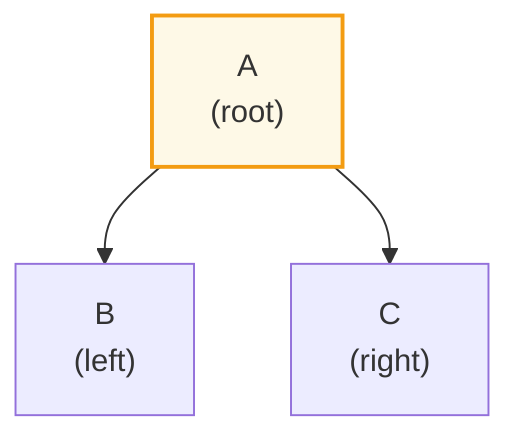
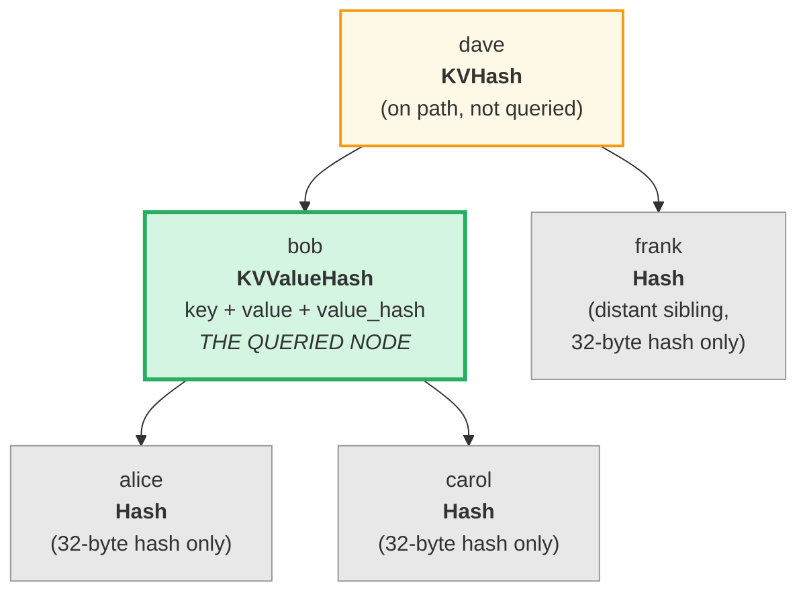
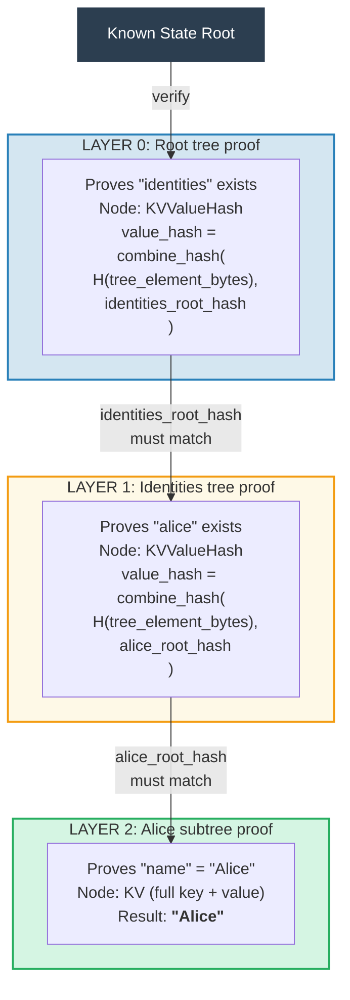
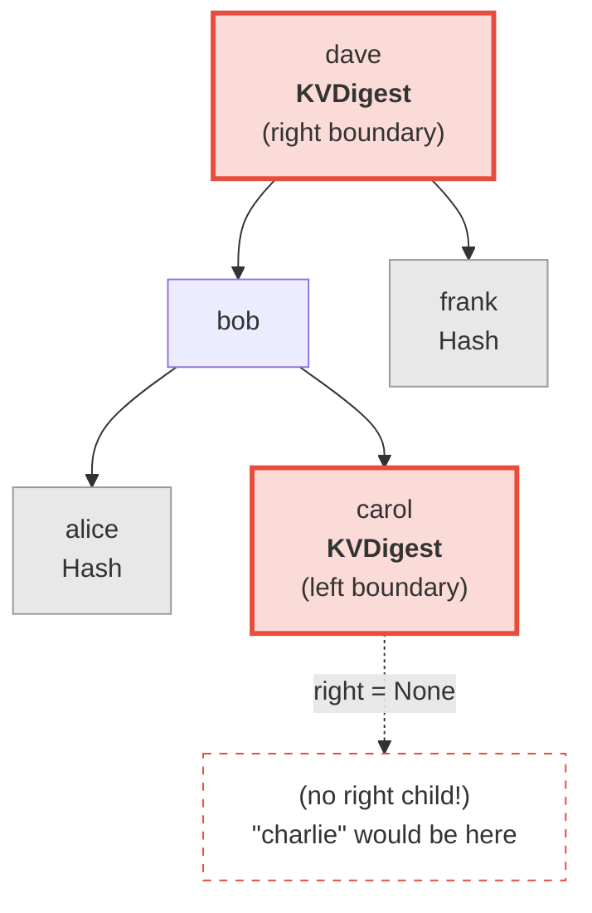
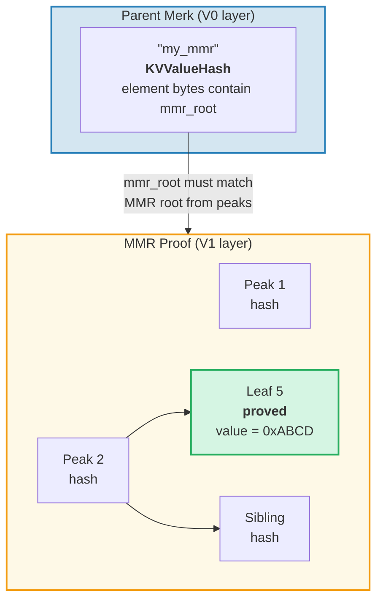
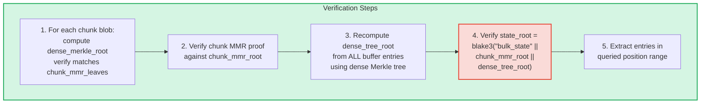
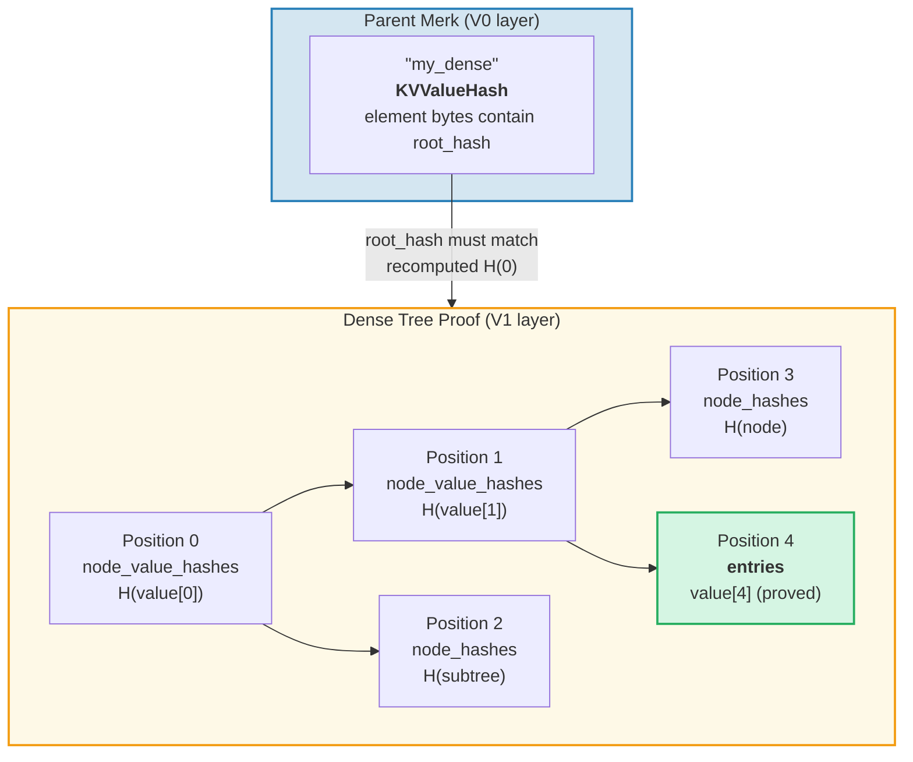

# 证明系统

GroveDB 的证明系统允许任何一方在没有完整数据库的情况下验证查询结果的正确性。证明是相关树结构的紧凑表示，允许重构根哈希。

## 基于栈的证明操作

证明编码为一系列**操作**，使用栈机器重构部分树：

```rust
// merk/src/proofs/mod.rs
pub enum Op {
    Push(Node),        // Push a node onto the stack (ascending key order)
    PushInverted(Node),// Push a node (descending key order)
    Parent,            // Pop parent, pop child → attach child as LEFT of parent
    Child,             // Pop child, pop parent → attach child as RIGHT of parent
    ParentInverted,    // Pop parent, pop child → attach child as RIGHT of parent
    ChildInverted,     // Pop child, pop parent → attach child as LEFT of parent
}
```

使用栈执行：

证明操作：`Push(B), Push(A), Parent, Push(C), Child`

| 步骤 | 操作 | 栈（顶部→右） | 动作 |
|------|-----------|-------------------|--------|
| 1 | Push(B) | [ B ] | 将 B 压入栈 |
| 2 | Push(A) | [ B , A ] | 将 A 压入栈 |
| 3 | Parent | [ A{left:B} ] | 弹出 A（父），弹出 B（子），B → A 的左子节点 |
| 4 | Push(C) | [ A{left:B} , C ] | 将 C 压入栈 |
| 5 | Child | [ A{left:B, right:C} ] | 弹出 C（子），弹出 A（父），C → A 的右子节点 |

最终结果 — 栈上有一棵树：



> 验证者计算 `node_hash(A) = Blake3(kv_hash_A || node_hash_B || node_hash_C)` 并检查它是否与预期的根哈希匹配。

这是 `execute` 函数（`merk/src/proofs/tree.rs`）：

```rust
pub fn execute<I, F>(ops: I, collapse: bool, mut visit_node: F) -> CostResult<Tree, Error>
where
    I: IntoIterator<Item = Result<Op, Error>>,
    F: FnMut(&Node) -> Result<(), Error>,
{
    let mut stack: Vec<Tree> = Vec::with_capacity(32);

    for op in ops {
        match op? {
            Op::Parent => {
                let (mut parent, child) = (try_pop(&mut stack), try_pop(&mut stack));
                parent.left = Some(Child { tree: Box::new(child), hash: child.hash() });
                stack.push(parent);
            }
            Op::Child => {
                let (child, mut parent) = (try_pop(&mut stack), try_pop(&mut stack));
                parent.right = Some(Child { tree: Box::new(child), hash: child.hash() });
                stack.push(parent);
            }
            Op::Push(node) => {
                visit_node(&node)?;
                stack.push(Tree::from(node));
            }
            // ... Inverted variants swap left/right
        }
    }
    // Final item on stack is the root
}
```

## 证明中的节点类型

每个 `Push` 携带一个 `Node`，包含验证所需的最少信息：

```rust
pub enum Node {
    // Minimum info — just the hash. Used for distant siblings.
    Hash(CryptoHash),

    // KV hash for nodes on the path but not queried.
    KVHash(CryptoHash),

    // Full key-value for queried items.
    KV(Vec<u8>, Vec<u8>),

    // Key, value, and pre-computed value_hash.
    // Used for subtrees where value_hash = combine_hash(...)
    KVValueHash(Vec<u8>, Vec<u8>, CryptoHash),

    // KV with feature type — for ProvableCountTree or chunk restoration.
    KVValueHashFeatureType(Vec<u8>, Vec<u8>, CryptoHash, TreeFeatureType),

    // Reference: key, dereferenced value, hash of reference element.
    KVRefValueHash(Vec<u8>, Vec<u8>, CryptoHash),

    // For items in ProvableCountTree.
    KVCount(Vec<u8>, Vec<u8>, u64),

    // KV hash + count for non-queried ProvableCountTree nodes.
    KVHashCount(CryptoHash, u64),

    // Reference in ProvableCountTree.
    KVRefValueHashCount(Vec<u8>, Vec<u8>, CryptoHash, u64),

    // For boundary/absence proofs in ProvableCountTree.
    KVDigestCount(Vec<u8>, CryptoHash, u64),

    // Key + value_hash for absence proofs (regular trees).
    KVDigest(Vec<u8>, CryptoHash),
}
```

节点类型的选择决定了验证者需要什么信息：

**查询："获取键 'bob' 的值"**



> 绿色 = 查询的节点（完整数据被揭示）。黄色 = 路径上的节点（仅 kv_hash）。灰色 = 兄弟节点（仅 32 字节节点哈希）。

编码为证明操作：

| # | 操作 | 效果 |
|---|----|----|
| 1 | Push(Hash(alice_node_hash)) | 压入 alice 哈希 |
| 2 | Push(KVValueHash("bob", value, value_hash)) | 压入 bob 的完整数据 |
| 3 | Parent | alice 成为 bob 的左子节点 |
| 4 | Push(Hash(carol_node_hash)) | 压入 carol 哈希 |
| 5 | Child | carol 成为 bob 的右子节点 |
| 6 | Push(KVHash(dave_kv_hash)) | 压入 dave 的 kv_hash |
| 7 | Parent | bob 子树成为 dave 的左子节点 |
| 8 | Push(Hash(frank_node_hash)) | 压入 frank 哈希 |
| 9 | Child | frank 成为 dave 的右子节点 |

## 多层证明生成

由于 GroveDB 是树的树，证明跨越多个层。每一层证明一棵 Merk 树的相关部分，各层通过组合 value_hash 机制连接：

**查询：** `Get ["identities", "alice", "name"]`



> **信任链：** `known_state_root → 验证 Layer 0 → 验证 Layer 1 → 验证 Layer 2 → "Alice"`。每一层重构的根哈希必须与上层的 value_hash 匹配。

验证者检查每一层，确认：
1. 该层的证明重构出预期的根哈希
2. 根哈希与父层的 value_hash 匹配
3. 顶层根哈希与已知的状态根匹配

## 证明验证

验证自底向上或自顶向下地跟踪证明层，使用 `execute` 函数重构每一层的树。证明树中的 `Tree::hash()` 方法根据节点类型计算哈希：

```rust
impl Tree {
    pub fn hash(&self) -> CostContext<CryptoHash> {
        match &self.node {
            Node::Hash(hash) => *hash,  // Already a hash, return directly

            Node::KVHash(kv_hash) =>
                node_hash(kv_hash, &self.child_hash(true), &self.child_hash(false)),

            Node::KV(key, value) =>
                kv_hash(key, value)
                    .flat_map(|kv_hash| node_hash(&kv_hash, &left, &right)),

            Node::KVValueHash(key, _, value_hash) =>
                kv_digest_to_kv_hash(key, value_hash)
                    .flat_map(|kv_hash| node_hash(&kv_hash, &left, &right)),

            Node::KVValueHashFeatureType(key, _, value_hash, feature_type) => {
                let kv = kv_digest_to_kv_hash(key, value_hash);
                match feature_type {
                    ProvableCountedMerkNode(count) =>
                        node_hash_with_count(&kv, &left, &right, *count),
                    _ => node_hash(&kv, &left, &right),
                }
            }

            Node::KVRefValueHash(key, referenced_value, ref_element_hash) => {
                let ref_value_hash = value_hash(referenced_value);
                let combined = combine_hash(ref_element_hash, &ref_value_hash);
                let kv = kv_digest_to_kv_hash(key, &combined);
                node_hash(&kv, &left, &right)
            }
            // ... other variants
        }
    }
}
```

## 不存在性证明

GroveDB 可以证明某个键**不存在**。这使用边界节点 — 如果缺失的键存在，与其相邻的节点：

**证明：** "charlie" 不存在



> **二分搜索：** alice < bob < carol < **"charlie"** < dave < frank。"charlie" 将位于 carol 和 dave 之间。Carol 的右子节点为 `None`，证明 carol 和 dave 之间没有任何内容。因此 "charlie" 不可能存在于这棵树中。

对于范围查询，不存在性证明表明在查询范围内没有未包含在结果集中的键。

## V1 证明 — 非 Merk 树

V0 证明系统仅适用于 Merk 子树，逐层向下穿过树丛层级结构。然而，**CommitmentTree**、**MmrTree**、**BulkAppendTree** 和 **DenseAppendOnlyFixedSizeTree** 元素将其数据存储在子 Merk 树之外。它们没有可进入的子 Merk — 它们的类型特定根哈希作为 Merk 子哈希流动。

**V1 证明格式**扩展了 V0 以处理这些非 Merk 树，使用类型特定的证明结构：

```rust
/// Which proof format a layer uses.
pub enum ProofBytes {
    Merk(Vec<u8>),            // Standard Merk proof ops
    MMR(Vec<u8>),             // MMR membership proof
    BulkAppendTree(Vec<u8>),  // BulkAppendTree range proof
    DenseTree(Vec<u8>),       // Dense tree inclusion proof
    CommitmentTree(Vec<u8>),  // Sinsemilla root (32 bytes) + BulkAppendTree proof
}

/// One layer of a V1 proof.
pub struct LayerProof {
    pub merk_proof: ProofBytes,
    pub lower_layers: BTreeMap<Vec<u8>, LayerProof>,
}
```

**V0/V1 选择规则：** 如果证明中的每一层都是标准 Merk 树，`prove_query` 生成 `GroveDBProof::V0`（向后兼容）。如果任何层涉及 MmrTree、BulkAppendTree 或 DenseAppendOnlyFixedSizeTree，则生成 `GroveDBProof::V1`。

### 非 Merk 树证明如何绑定到根哈希

父 Merk 树通过标准 Merk 证明节点（`KVValueHash`）证明元素的序列化字节。类型特定根（如 `mmr_root` 或 `state_root`）作为 Merk **子哈希**流动 — 它不嵌入在元素字节中：

```text
combined_value_hash = combine_hash(
    Blake3(varint(len) || element_bytes),   ← contains count, height, etc.
    type_specific_root                      ← mmr_root / state_root / dense_root
)
```

类型特定证明然后证明查询的数据与用作子哈希的类型特定根一致。

### MMR 树证明

MMR 证明演示特定叶子存在于 MMR 中的已知位置，且 MMR 的根哈希与存储在父 Merk 节点中的子哈希匹配：

```rust
pub struct MmrProof {
    pub mmr_size: u64,
    pub proof: MerkleProof,  // ckb_merkle_mountain_range::MerkleProof
    pub leaves: Vec<MmrProofLeaf>,
}

pub struct MmrProofLeaf {
    pub position: u64,       // MMR position
    pub leaf_index: u64,     // Logical leaf index
    pub hash: [u8; 32],      // Leaf hash
    pub value: Vec<u8>,      // Leaf value bytes
}
```



**查询键是位置：** 查询项将位置编码为大端 u64 字节（保持排序顺序）。`QueryItem::RangeInclusive` 使用大端编码的起始/结束位置选择连续范围的 MMR 叶子。

**验证：**
1. 从证明重构 `MmrNode` 叶子
2. 根据来自父 Merk 子哈希的预期 MMR 根验证 ckb `MerkleProof`
3. 交叉验证 `proof.mmr_size` 是否与元素存储的大小匹配
4. 返回已证明的叶子值

### BulkAppendTree 证明

BulkAppendTree 证明更复杂，因为数据存在于两个地方：已密封的块 blob 和进行中的缓冲区。范围证明必须返回：

- 与查询范围重叠的任何已完成块的**完整块 blob**
- 仍在缓冲区中的位置的**单个缓冲区条目**

```rust
pub struct BulkAppendTreeProof {
    pub chunk_power: u8,
    pub total_count: u64,
    pub chunk_blobs: Vec<(u64, Vec<u8>)>,       // (chunk_index, blob_bytes)
    pub chunk_mmr_size: u64,
    pub chunk_mmr_proof_items: Vec<[u8; 32]>,    // MMR sibling hashes
    pub chunk_mmr_leaves: Vec<(u64, [u8; 32])>,  // (mmr_pos, dense_merkle_root)
    pub buffer_entries: Vec<Vec<u8>>,             // ALL current buffer (dense tree) entries
    pub chunk_mmr_root: [u8; 32],
}
```



> **为什么包含所有缓冲区条目？** 缓冲区是一棵密集默克尔树，其根哈希承诺了每个条目。要验证 `dense_tree_root`，验证者必须从所有条目重建树。由于缓冲区受 `capacity` 条目限制（最多 65,535），这是可以接受的。

**限制计量：** 每个单独的值（在块内或缓冲区中）都计入查询限制，而不是每个块 blob 作为整体。如果查询有 `limit: 100`，一个包含 1024 条目的块有 500 条与范围重叠，所有 500 条都计入限制。

### DenseAppendOnlyFixedSizeTree 证明

密集树证明演示特定位置持有特定值，并经过树的根哈希（作为 Merk 子哈希流动）认证。所有节点使用 `blake3(H(value) || H(left) || H(right))`，因此认证路径上的祖先节点只需要其 32 字节**值哈希** — 不需要完整值。

```rust
pub struct DenseTreeProof {
    pub entries: Vec<(u16, Vec<u8>)>,            // proved (position, value)
    pub node_value_hashes: Vec<(u16, [u8; 32])>, // ancestor value hashes on auth path
    pub node_hashes: Vec<(u16, [u8; 32])>,       // precomputed sibling subtree hashes
}
```

> `height` 和 `count` 来自父 Element（由 Merk 层次结构认证），而非证明。



**验证**是一个不需要存储的纯函数：
1. 从 `entries`、`node_value_hashes` 和 `node_hashes` 构建查找映射
2. 从位置 0 递归重新计算根哈希：
   - 位置在 `node_hashes` 中有预计算哈希 → 直接使用
   - 位置在 `entries` 中有值 → `blake3(blake3(value) || H(left) || H(right))`
   - 位置在 `node_value_hashes` 中有哈希 → `blake3(hash || H(left) || H(right))`
   - 位置 `>= count` 或 `>= capacity` → `[0u8; 32]`
3. 将计算的根与来自父元素的预期根哈希比较
4. 成功时返回已证明的条目

**多位置证明**合并重叠的认证路径：共享的祖先及其值只出现一次，使其比独立证明更紧凑。

---
