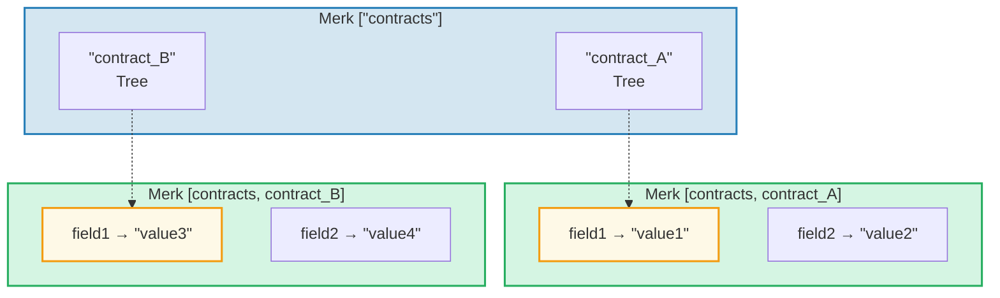
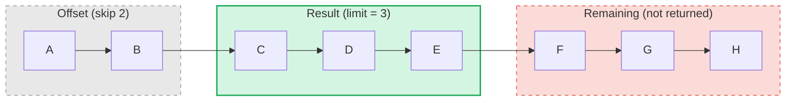

# 查询系统

## PathQuery 结构

GroveDB 查询使用 `PathQuery` 类型，它将路径（在哪里查找）与查询（选择什么）相结合：

```rust
pub struct PathQuery {
    pub path: Vec<Vec<u8>>,         // Starting path in the grove
    pub query: SizedQuery,          // What to select
}

pub struct SizedQuery {
    pub query: Query,               // The selection criteria
    pub limit: Option<u16>,         // Maximum number of results
    pub offset: Option<u16>,        // Skip first N results
}
```

## Query 类型

```rust
pub struct Query {
    pub items: Vec<QueryItem>,              // What to match
    pub default_subquery_branch: SubqueryBranch,
    pub conditional_subquery_branches: Option<IndexMap<QueryItem, SubqueryBranch>>,
    pub left_to_right: bool,                // Iteration direction
    pub add_parent_tree_on_subquery: bool,  // Include parent tree element in results (v2)
}
```

> **`add_parent_tree_on_subquery`**（v2）：当为 `true` 时，父树元素（例如 CountTree 或 SumTree）会与其子节点的值一起包含在查询结果中。这让你可以在一次查询中同时检索聚合值和单个元素。

## QueryItem — 选择什么

每个 `QueryItem` 指定要匹配的键或范围：

```rust
pub enum QueryItem {
    Key(Vec<u8>),                           // Exact key match
    Range(Range<Vec<u8>>),                  // Exclusive range [start..end)
    RangeInclusive(RangeInclusive<Vec<u8>>),// Inclusive range [start..=end]
    RangeFull(RangeFull),                   // All keys
    RangeFrom(RangeFrom<Vec<u8>>),          // [start..)
    RangeTo(RangeTo<Vec<u8>>),              // [..end)
    RangeToInclusive(RangeToInclusive<Vec<u8>>), // [..=end]
    RangeAfter(RangeFrom<Vec<u8>>),         // (start..) exclusive start
    RangeAfterTo(Range<Vec<u8>>),           // (start..end) exclusive both
    RangeAfterToInclusive(RangeInclusive<Vec<u8>>), // (start..=end]
}
```

查询示例：

Merk 树（已排序）：`alice  bob  carol  dave  eve  frank`

| 查询 | 选择 | 结果 |
|-------|-----------|--------|
| `Key("bob")` | alice **[bob]** carol dave eve frank | bob |
| `RangeInclusive("bob"..="dave")` | alice **[bob carol dave]** eve frank | bob, carol, dave |
| `RangeAfter("carol"..)` | alice bob carol **[dave eve frank]** | dave, eve, frank |
| `RangeFull`, limit=2 | **[alice bob]** carol dave eve frank *（被限制截停）* | alice, bob |
| `RangeFull`, limit=2, right-to-left | alice bob carol dave **[eve frank]** *（被限制截停）* | frank, eve |

## 子查询和条件分支

GroveDB 查询真正强大之处在于**子查询** — 当查询匹配到 Tree 元素时，查询可以自动进入该子树：



> **PathQuery：** `path: ["contracts"], query: RangeFull`，附带 `default_subquery: Key("field1")`
>
> **执行过程：**
> 1. 对 ["contracts"] 执行 `RangeFull` → 匹配 contract_A、contract_B
> 2. 两者都是 Tree 元素 → 使用子查询 `Key("field1")` 进入
> 3. contract_A → "value1"，contract_B → "value3"
>
> **结果：** `["value1", "value3"]`

**条件子查询**允许你根据匹配到的键应用不同的子查询：

```rust
conditional_subquery_branches: Some(indexmap! {
    QueryItem::Key(b"contract_A".to_vec()) => SubqueryBranch {
        subquery: Some(Query { items: vec![Key(b"field1".to_vec())] }),
        ..
    },
    QueryItem::Key(b"contract_B".to_vec()) => SubqueryBranch {
        subquery: Some(Query { items: vec![Key(b"field2".to_vec())] }),
        ..
    },
})
```

这将从 `contract_A` 获取 `field1`，但从 `contract_B` 获取 `field2`。

## 有限查询 — 限制和偏移

`SizedQuery` 包装器添加分页功能：



> `SizedQuery { query: RangeFull, limit: Some(3), offset: Some(2) }` → 结果：**[C, D, E]**

结合 `left_to_right: false` 时，迭代方向反转：

```text
    SizedQuery {
        query: Query { items: [RangeFull], left_to_right: false, .. },
        limit: Some(3),
        offset: None
    }

    Result: [H, G, F]
```

## 查询合并

多个 PathQuery 可以合并为单个查询以提高效率。合并算法找到公共路径前缀并组合查询项：

```text
    Query A: path=["users"], query=Key("alice")
    Query B: path=["users"], query=Key("bob")

    Merged:  path=["users"], query=items=[Key("alice"), Key("bob")]
```

---
