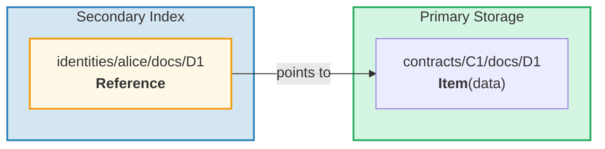
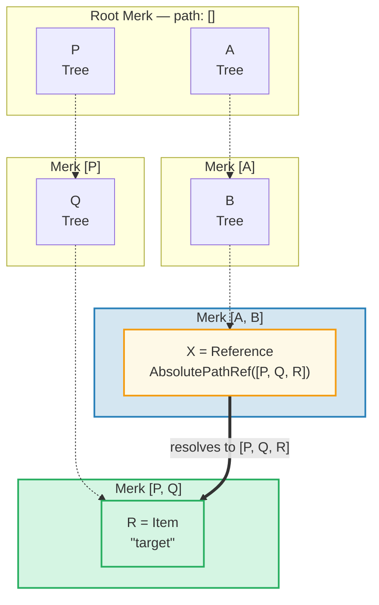
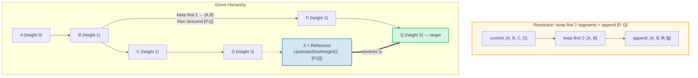
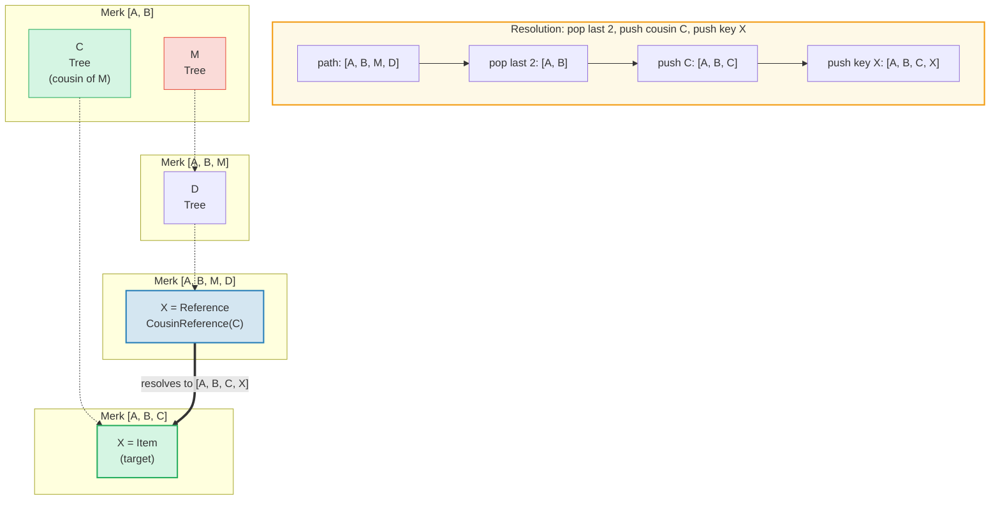
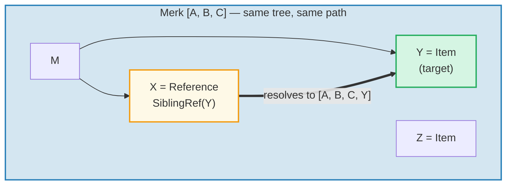
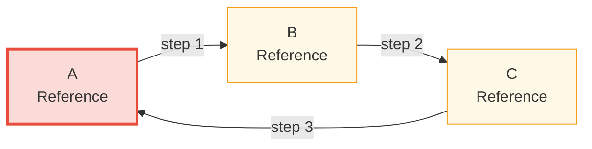

# 引用系统

## 为什么需要引用

在层级数据库中，你经常需要从多个路径访问相同的数据。例如，文档可能存储在其合约下，但也需要按所有者身份可查询。**引用（Reference）** 是 GroveDB 的解决方案 — 它们是从一个位置指向另一个位置的指针，类似于文件系统中的符号链接。



关键特性：
- 引用是**可认证的** — 引用的 value_hash 同时包含引用本身和被引用的元素
- 引用可以**链式跟踪** — 一个引用可以指向另一个引用
- 循环检测防止无限循环
- 可配置的跳数限制防止资源耗尽

## 七种引用类型

```rust
// grovedb-element/src/reference_path/mod.rs
pub enum ReferencePathType {
    AbsolutePathReference(Vec<Vec<u8>>),
    UpstreamRootHeightReference(u8, Vec<Vec<u8>>),
    UpstreamRootHeightWithParentPathAdditionReference(u8, Vec<Vec<u8>>),
    UpstreamFromElementHeightReference(u8, Vec<Vec<u8>>),
    CousinReference(Vec<u8>),
    RemovedCousinReference(Vec<Vec<u8>>),
    SiblingReference(Vec<u8>),
}
```

让我们通过图解逐一介绍。

### AbsolutePathReference（绝对路径引用）

最简单的类型。存储目标的完整路径：



> X 存储完整的绝对路径 `[P, Q, R]`。无论 X 位于何处，它始终解析到相同的目标。

### UpstreamRootHeightReference（上游根高度引用）

保留当前路径的前 N 个段，然后追加新路径：



### UpstreamRootHeightWithParentPathAdditionReference

类似 UpstreamRootHeight，但会重新追加当前路径的最后一个段：

```text
    Reference at path [A, B, C, D, E] key=X
    UpstreamRootHeightWithParentPathAdditionReference(2, [P, Q])

    Current path:    [A, B, C, D, E]
    Keep first 2:    [A, B]
    Append [P, Q]:   [A, B, P, Q]
    Re-append last:  [A, B, P, Q, E]   ← "E" from original path added back

    Useful for: indexes where the parent key should be preserved
```

### UpstreamFromElementHeightReference（从元素高度上游引用）

丢弃最后 N 个段，然后追加：

```text
    Reference at path [A, B, C, D] key=X
    UpstreamFromElementHeightReference(1, [P, Q])

    Current path:     [A, B, C, D]
    Discard last 1:   [A, B, C]
    Append [P, Q]:    [A, B, C, P, Q]
```

### CousinReference（表亲引用）

仅替换直接父级为新键：



> "表亲"是引用的祖父节点的兄弟子树。引用向上导航两级，然后进入表亲子树。

### RemovedCousinReference

类似 CousinReference，但用多段路径替换父级：

```text
    Reference at path [A, B, C, D] key=X
    RemovedCousinReference([M, N])

    Current path:  [A, B, C, D]
    Pop parent C:  [A, B]
    Append [M, N]: [A, B, M, N]
    Push key X:    [A, B, M, N, X]
```

### SiblingReference（兄弟引用）

最简单的相对引用 — 仅更改同一父级内的键：



> 最简单的引用类型。X 和 Y 是同一棵 Merk 树中的兄弟 — 解析仅更改键，路径保持不变。

## 引用跟踪和跳数限制

当 GroveDB 遇到 Reference 元素时，它必须**跟踪**它以找到实际值。由于引用可以指向其他引用，这涉及一个循环：

```rust
// grovedb/src/reference_path.rs
pub const MAX_REFERENCE_HOPS: usize = 10;

pub fn follow_reference(...) -> CostResult<ResolvedReference, Error> {
    let mut hops_left = MAX_REFERENCE_HOPS;
    let mut visited = HashSet::new();

    while hops_left > 0 {
        // Resolve reference path to absolute path
        let target_path = current_ref.absolute_qualified_path(...);

        // Check for cycles
        if !visited.insert(target_path.clone()) {
            return Err(Error::CyclicReference);
        }

        // Fetch element at target
        let element = Element::get(target_path);

        match element {
            Element::Reference(next_ref, ..) => {
                // Still a reference — keep following
                current_ref = next_ref;
                hops_left -= 1;
            }
            other => {
                // Found the actual element!
                return Ok(ResolvedReference { element: other, ... });
            }
        }
    }

    Err(Error::ReferenceLimit)  // Exceeded 10 hops
}
```

## 循环检测

`visited` HashSet 跟踪我们见过的所有路径。如果遇到已访问过的路径，说明存在循环：



> **循环检测跟踪：**
>
> | 步骤 | 跟踪 | visited 集合 | 结果 |
> |------|--------|-------------|--------|
> | 1 | 从 A 开始 | { A } | A 是 Ref → 跟踪 |
> | 2 | A → B | { A, B } | B 是 Ref → 跟踪 |
> | 3 | B → C | { A, B, C } | C 是 Ref → 跟踪 |
> | 4 | C → A | A 已在 visited 中！ | **Error::CyclicRef** |
>
> 没有循环检测，这将永远循环。`MAX_REFERENCE_HOPS = 10` 也限制了长链的遍历深度。

## Merk 中的引用 — 组合值哈希

当引用存储在 Merk 树中时，其 `value_hash` 必须同时认证引用结构和被引用的数据：

```rust
// merk/src/tree/kv.rs
pub fn update_hashes_using_reference_value_hash(
    mut self,
    reference_value_hash: CryptoHash,
) -> CostContext<Self> {
    // Hash the reference element's own bytes
    let actual_value_hash = value_hash(self.value_as_slice());

    // Combine: H(reference_bytes) ⊕ H(referenced_data)
    let combined = combine_hash(&actual_value_hash, &reference_value_hash);

    self.value_hash = combined;
    self.hash = kv_digest_to_kv_hash(self.key(), self.value_hash());
    // ...
}
```

这意味着更改引用本身或它指向的数据都会改变根哈希 — 两者都在密码学上绑定。

---
