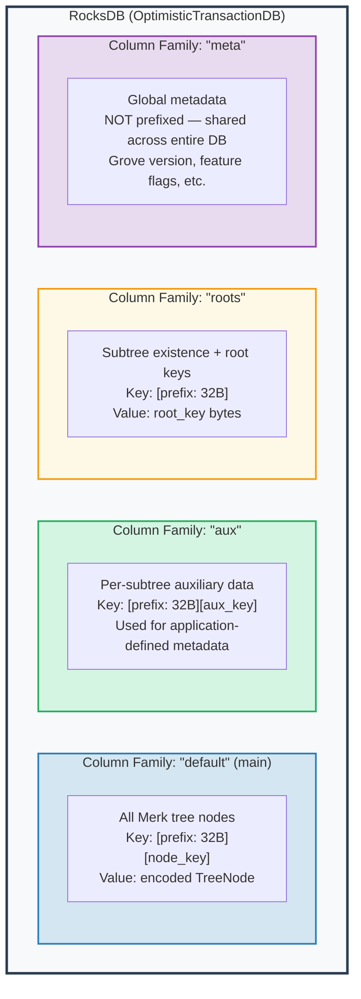
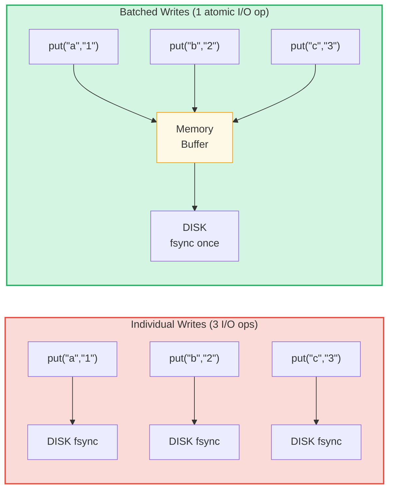

# 存储层

## RocksDB 与 OptimisticTransactionDB

GroveDB 使用 **RocksDB** 作为存储后端，具体使用支持事务的 `OptimisticTransactionDB` 变体：

```rust
// storage/src/rocksdb_storage/storage.rs
pub(crate) type Db = OptimisticTransactionDB;
pub(crate) type Tx<'db> = Transaction<'db, Db>;

pub struct RocksDbStorage {
    db: OptimisticTransactionDB,
}
```

**乐观事务**的工作方式是假设不会有冲突。如果两个事务修改了相同的数据，第二个提交的事务将失败并可以重试。对于冲突很少的工作负载，这比悲观锁定更高效。

RocksDB 选项针对 GroveDB 的工作负载进行了调优：

```rust
lazy_static! {
    static ref DEFAULT_OPTS: rocksdb::Options = {
        let mut opts = rocksdb::Options::default();
        opts.create_if_missing(true);
        opts.increase_parallelism(num_cpus::get() as i32);
        opts.set_allow_mmap_writes(true);
        opts.set_allow_mmap_reads(true);
        opts.create_missing_column_families(true);
        opts.set_atomic_flush(true);
        opts
    };
}
```

## 四个列族

RocksDB 列族（column family）充当单个数据库内的独立键值命名空间。GroveDB 使用四个：



> **示例：** "default" 列族中的键 `[ab3fc2...][6e616d65]` 映射到 `TreeNode{key:"name", val:"Al"}`，其中 `ab3fc2...` 是 `Blake3(path)`，`6e616d65` 是 `"name"` 的字节表示。

```rust
pub(crate) const AUX_CF_NAME: &str = "aux";
pub(crate) const ROOTS_CF_NAME: &str = "roots";
pub(crate) const META_CF_NAME: &str = "meta";
// Main data uses the default column family
```

## 前缀存储上下文

每棵子树获得自己的**前缀存储上下文** — 一个自动将 32 字节 Blake3 前缀添加到所有键的包装器：

```text
    Subtree path: ["identities", "alice"]
    Prefix: Blake3(path) = [0xab, 0x3f, 0xc2, ...]  (32 bytes)

    When subtree stores key "name" with value "Alice":

    RocksDB key:   [0xab 0x3f 0xc2 ... (32 bytes) | 0x6e 0x61 0x6d 0x65]
                    \_________prefix________/       \_____"name"_____/

    RocksDB value: [encoded TreeNode with value "Alice"]
```

上下文类型：

```text
    Without transaction:
    PrefixedRocksDbImmediateStorageContext
    └── Reads/writes directly to DB with prefix

    With transaction:
    PrefixedRocksDbTransactionContext
    └── Reads/writes through a Transaction with prefix
```

两者都实现了 `StorageContext` trait：

```rust
pub trait StorageContext<'db> {
    fn get(&self, key: &[u8]) -> CostResult<Option<Vec<u8>>, Error>;
    fn get_aux(&self, key: &[u8]) -> CostResult<Option<Vec<u8>>, Error>;
    fn get_root(&self, key: &[u8]) -> CostResult<Option<Vec<u8>>, Error>;
    fn get_meta(&self, key: &[u8]) -> CostResult<Option<Vec<u8>>, Error>;
    fn put(&self, key: &[u8], value: &[u8], ...) -> CostResult<(), Error>;
    fn put_aux(&self, key: &[u8], value: &[u8], ...) -> CostResult<(), Error>;
    fn put_root(&self, key: &[u8], value: &[u8], ...) -> CostResult<(), Error>;
    fn put_meta(&self, key: &[u8], value: &[u8], ...) -> CostResult<(), Error>;
    fn delete(&self, key: &[u8], ...) -> CostResult<(), Error>;
    // ...
}
```

## 写批次和事务模型

为了提高性能，GroveDB 将写入累积到批次中：



> 3 次磁盘同步 vs 1 次磁盘同步 = 约 3 倍速度提升。批量写入也是**原子的**（全部成功或全部失败）。

`StorageBatch` 累积一起刷新的操作：

```rust
pub struct StorageBatch {
    operations: RefCell<Vec<AbstractBatchOperation>>,
}
```

## 关键的 commit_local() 模式

使用事务时，必须遵循一个关键模式。事务内的写入是缓冲的 — 在提交之前不可见：

```rust
// CORRECT pattern:
{
    let tx = db.start_transaction();
    let storage_ctx = db.get_transactional_storage_context(path, &tx);

    storage_ctx.put(key, value);  // Writes to transaction buffer

    drop(storage_ctx);            // Release borrow on tx
    tx.commit_local();            // Flush transaction to DB
}

// INCORRECT — data is lost:
{
    let tx = db.start_transaction();
    let storage_ctx = db.get_transactional_storage_context(path, &tx);

    storage_ctx.put(key, value);  // Writes to transaction buffer

    // tx drops here without commit_local()!
    // All writes are ROLLED BACK!
}
```

这尤其重要，因为 `storage_ctx` 借用了事务。你必须先 `drop(storage_ctx)` 才能调用 `tx.commit_local()`。

---
